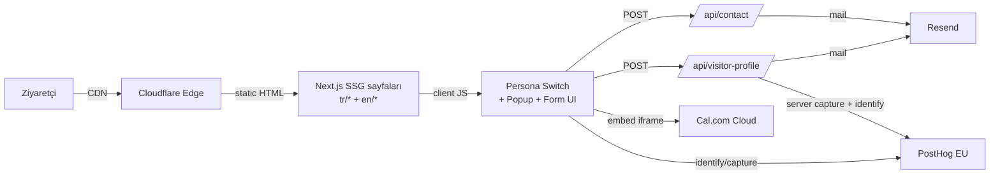
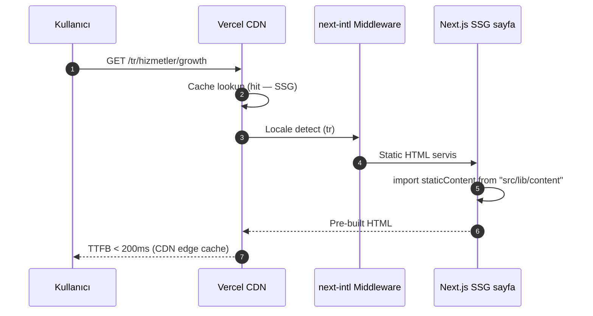
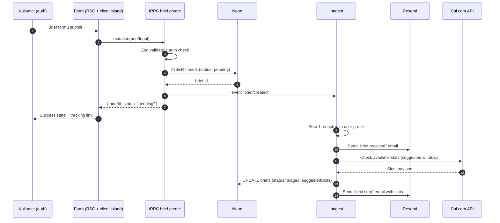
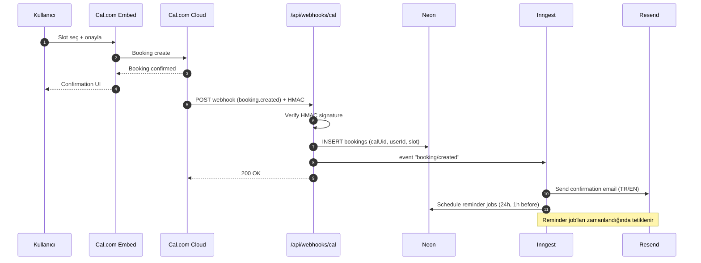
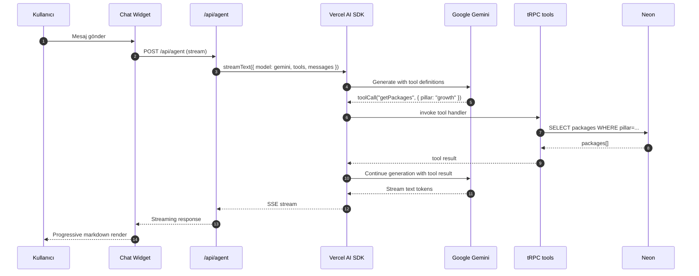
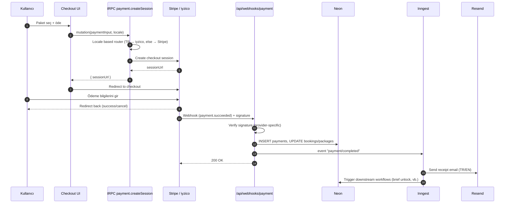

# 05 — Teknik Mimari

> **Amaç:** INDOLES kurumsal web platformunun üretim ortamına çıkacak teknik temelini, bileşen sınırlarını, veri akışlarını ve operasyonel modelini tek bir referans belgede sabitlemek.
>
> **Statü:** Onaylı — implementasyon için kaynak doküman.
> **Bağlı belgeler:** `04-design-system-principles.md`, `docs/decisions/ADR-001-agent-orchestration.md`, `docs/decisions/ADR-002-stitch-design-reject.md`.

> **Son güncelleme:** 2026-08-19 — ADR-015 (design system v2) sonrası doğrulama.
>
> **Doğrulama notu (2026-08-19):** §3.2 (brief → tRPC), §3.3 (rezervasyon webhook),
> §3.4 (AI chatbot tool call) ve §3.6 (ödeme) şemaları kaldırılmış katmanlara
> aittir ve **uygulanmamıştır** — yalnızca tarihsel bağlam için duruyorlar.
> Geçerli akışlar §3.1 ve §3.5'tir.
>
> **Route sayısı düzeltmesi:** §1.3 "2 REST Route Handler" diyor; diskte 5 route
> vardır: `/api/contact` ve `/api/visitor-profile` (canlı), `/api/health` (ops
> probe), `/api/upload` ve `/api/webhooks/cal` (**TODO stub** — implementasyonu
> yok, `webhooks/cal` kaldırılmış Inngest'e trigger atmaya çalışıyor). İkisi
> temizlenmeli veya tamamlanmalı.
>
> ADR-006 kapsamında Sanity referansları kaldırıldı; içerik statik TS + MDX'tir.

---

## 1. Mimari Özeti ve Kararlar

### 1.1 Tek cümlede
INDOLES web, **Cloudflare Workers üzerinde (OpenNext adaptörü) deploy edilen, TypeScript tabanlı Next.js 15 SSG + 2 REST API route mimarisidir**; DB, auth, payment, AI agent ve background job yoktur; içerik katmanı git içinde statik TS + MDX olarak tutulur (ADR-006, ADR-010).

### 1.2 Üst düzey prensipler
- **Statik önce.** Tüm sayfalar build-time SSG; sadece 2 endpoint dinamik. Statik varlıklar Worker'a hiç uğramadan Cloudflare assets katmanından servis edilir.
- **TypeScript her yerde.** Frontend, API route'lar, statik içerik tanımları — tek dil, tek tip sistemi.
- **Edge'i dar tut.** Middleware yalnızca locale redirect (next-intl). Veri erişimi yok.
- **Operasyonel sıfır yük.** DB migration yok, webhook yok, background job yok, auth session yok (ADR-007/008/009/010/011).
- **Observability gün sıfırdan.** Sentry (hata) + PostHog EU (ürün analitiği, funnel, feature flag, session replay) baştan bağlı.
- **Güvenlik:** Cloudflare Turnstile (form spam), CSP, Zod input validation. Auth yok ama form endpointleri rate-limited.

### 1.3 Kararların özeti

| Karar alanı | Seçim | Reddedilen / Kaldırılan |
|---|---|---|
| Deploy hedefi | Cloudflare Workers + OpenNext — bkz. ADR-024 | Vercel (ADR-012, superseded) · AWS SST Ion |
| Framework | Next.js 15 App Router (SSG) | Remix, Astro, SvelteKit |
| Monorepo | **Yok** — tek Next.js projesi | Turborepo, Nx |
| Veritabanı | **Yok** (launch) | Neon Postgres — bkz. ADR-010 |
| ORM | **Yok** | Drizzle — bkz. ADR-010 |
| API | 2 REST Route Handler (`/api/contact`, `/api/visitor-profile`) | tRPC — bkz. ADR-010/ADR-008 |
| AI orkestrasyon | **Yok** (launch) | Vercel AI SDK + Gemini — bkz. ADR-007 |
| Auth | **Yok** (launch) | Clerk — bkz. ADR-008 |
| İçerik | Statik TS + MDX (git-in-content) | Sanity — bkz. ADR-006 |
| Randevu | Cal.com Cloud (embed + prefill) | Cal.com API + webhook |
| Ödeme | **Yok** (launch) | Stripe + iyzico — bkz. ADR-009 |
| Background jobs | **Yok** (launch) | Inngest — bkz. ADR-011 |
| E-posta | Resend + React Email | SendGrid, Postmark |
| Spam koruma | Cloudflare Turnstile | — |
| Observability | Sentry + PostHog EU | Axiom (kaldırıldı), CloudWatch (kaldırıldı) |
| Test | Vitest + Playwright | Jest, Cypress |
| CI/CD | GitHub Actions + `opennextjs-cloudflare preview` | CircleCI |
| Environment stratejisi | Development → Preview (per-PR) → Production | Ek staging ortamı |

Sadeleştirme gerekçeleri: ADR-007 (agent), ADR-008 (auth), ADR-009 (payment), ADR-010 (DB), ADR-011 (Inngest). Dağıtım: ADR-024 (Cloudflare Workers; ADR-012/Vercel'in yerini aldı).

---

## 2. Sistem Topolojisi

### 2.1 Topoloji diyagramı

> **Not:** Sadeleştirme sonrası (ADR-007/008/009/010/011/012). Eski AWS/tRPC/Neon/Clerk/Stripe/Inngest diyagramı bu dosyanın git geçmişinde korunur.



### 2.2 Katman sınırları

| Katman | İçerik |
|--------|--------|
| **Statik** | Tüm sayfalar build-time SSG. Persona switch, popup, form = client-side React. Cloudflare edge'den servis (assets binding — Worker'a uğramaz). |
| **Serverless (2 route)** | `/api/contact` (iletişim formu → Resend mail + PostHog). `/api/visitor-profile` (popup Stage 3 submit → Resend + PostHog). Her ikisi <100 satır, Node runtime. |
| **External (3 servis)** | Cal.com (rezervasyon embed), PostHog EU (analytics + person properties + feature flags + replay), Resend (transactional mail). |

**Kaldırılan katmanlar (sadeleştirme):** DB (ADR-010), Auth/Clerk (ADR-008), AI Agent (ADR-007), Payments/Stripe/iyzico (ADR-009), Inngest background jobs (ADR-011), AWS SST/OpenNext (ADR-012).

---

## 3. Akış Şemaları

> **Not:** §3.2 (brief → tRPC), §3.3 (rezervasyon webhook), §3.4 (AI chatbot), §3.6 (ödeme) akışları kaldırılan katmanlara aitti — git geçmişinde arşivlendi. Aşağıda sadeleştirilmiş mimarinin geçerli akışları yer almaktadır.

### 3.1 Request lifecycle



### 3.2 Brief gönderim akışı



### 3.3 Rezervasyon akışı



### 3.4 AI chatbot tool call akışı



### 3.5 İçerik güncelleme ve revalidate

ADR-006 kapsamında Sanity kaldırıldığı için webhook tabanlı ISR revalidate kaldırıldı. İçerik `src/lib/content/*.ts` ve `content/yazilar/*.mdx` içinde statik tutulur.

İçerik güncellenirken: (1) ilgili `.ts` veya `.mdx` dosyası git üzerinden güncellenir, (2) PR ile `main`'e merge edilir, (3) production deploy otomatik tetiklenir — yeni build içeriği alır.

Bir sayfayı hızlıca güncellenmesi gerektiğinde (acil düzeltme) `revalidatePath` veya `revalidateTag` manuel olarak admin panelden veya bir Route Handler üzerinden tetiklenebilir; Sanity webhook'una gerek yoktur.

### 3.6 Ödeme akışı



---

## 4. Teknoloji Yığını (detay)

### 4.1 Framework ve dil
- **Next.js 15 App Router** — RSC varsayılan, client island'lar `"use client"` ile opt-in. Streaming, parallel routes, intercepting routes kullanılacak.
- **TypeScript strict** — `strict: true`, `noUncheckedIndexedAccess: true`, `exactOptionalPropertyTypes: true`. `any` yasak, `unknown` + type narrowing tercih.
- **React 19** — Server Actions, `use()` hook, form actions. Server Actions'ı dışarıya maruz bırakan yerlerde rate limiting + Zod validation zorunlu.

### 4.2 Styling ve design system
- **Tailwind CSS v4** — `lib/design/tokens.ts` üzerinden konfigüre; manuel `tailwind.config.ts` minimum, token'lar tek kaynak.
- **CSS variables** — Dark mode opsiyonu için değil (şu an light-only), dinamik marka rengi override'ı için hazır.
- **Radix UI primitives** — Dialog, Popover, Tooltip, Dropdown. Headless — kendi design system'imizle sarılır.
- **Class Variance Authority (`cva`)** — Component variant API'si. `Button`, `Badge`, `Card` vb. variant'ları cva ile tanımlanır.
- **Framer Motion** — Sadece gerçek değer katan yerlerde (page transitions, scroll-triggered reveal, modal enter/exit). Dekoratif animasyon yasak (bkz. 04).

### 4.3 Veri katmanı

**DB yok** (ADR-010). Ziyaretçi verisi iki yerde yaşar:
- **PostHog person properties:** `persona`, `industry`, `role`, `company_name`, `first_seen_locale`, `utm_*`, `popup_completed_at`, `selected_problems`
- **Resend mail arşivi:** Her popup submit ve her contact submit bir mail olarak INDOLES inbox'ında kalır.

### 4.4 API ve sunucu katmanı
- **2 REST Route Handler** — `POST /api/contact` (iletişim formu) + `POST /api/visitor-profile` (popup Stage 3 submit). tRPC yok (ADR-008/010).
- **Zod** — Her iki endpoint'te input validation.
- **Cloudflare Turnstile** — Spam koruma; her form submit'te sunucu-taraflı doğrulama.

### 4.5 Kimlik ve yetkilendirme

**Auth yok** (ADR-008). Launch'ta self-signup yok, kullanıcı hesabı yok, session yok.

### 4.6 AI katmanı

**AI agent yok** (ADR-007). Launch sonrası 6 ay konuşma hacmi + rezervasyon conversion metriklerine bakılacak; yeterli neden oluşursa Faz 2'de FAQ asistanı olarak geri gelebilir.

### 4.7 İçerik katmanı

ADR-006 kapsamında Sanity kaldırıldı; içerik git içinde statik TS ve MDX dosyalarında tutulur.

| İçerik türü | Konum |
|---|---|
| Hizmetler (12 adet) | `src/lib/content/services.ts` |
| Pillar'lar | `src/lib/content/pillars.ts` |
| Paketler | `src/lib/content/packages.ts` |
| Vaka çalışmaları | `src/lib/content/cases.ts` |
| Danışmanlar | `src/lib/content/consultants.ts` |
| Blog / journal yazıları | `content/yazilar/{slug}.{tr,en}.mdx` |
| Sayfa içerikleri (hakkımızda, manifesto) | `messages/{tr,en}.json` |
| KVKK / yasal metinler | `content/hukuki/*.md` |
| Görseller | `public/images/` |

- **TypeScript tipler** — İçerik şemaları `src/lib/content/types.ts`'de tanımlanır; Sanity typegen veya GROQ yoktur, doğrudan TS importlar kullanılır.
- **Preview:** Sanity Presentation tool kaldırıldı. İçerik değişiklikleri git branch üzerinden izlenir; gerektiğinde Next.js draft mode ile preview branch'te incelenebilir.

### 4.8 Randevu ve iletişim
- **Cal.com Cloud** — `@calcom/embed-react` ile inline embed. Popup Stage 3'te prefill (name, email, persona, selected_problems). Webhook yok — Cal.com kendi onay emailini gönderir.
- **Resend** — Transactional email. React Email ile template'ler; `emails/` klasöründe TSX dosyaları.
- **E-posta tipleri** — Contact form onayı, popup submit (visitor profile) bildirimi.

### 4.9 Ödeme

**Ödeme yok** (ADR-009). Paketler görüşme-sonrası teklifleşme ile satılır; online checkout Faz 2 kararı.

### 4.10 Background jobs

**Background job yok** (ADR-011). Mail + PostHog event yeterli; async iş ihtiyacı somutlaşırsa Faz 2'de Inngest veya Vercel Cron değerlendirilir.

### 4.11 Analitik ve observability
- **PostHog EU Cloud** — Ürün analitiği, funnel tracking, feature flags, session replay (opt-in). Person properties ile kalıcı veri akışı (DB yok).
- **Sentry** — Hata takibi + performance monitoring. Server + client.
- Axiom ve CloudWatch kaldırıldı (ADR-012 — AWS çıkışı).

### 4.12 Test
- **Vitest** — Unit + integration. `*.test.ts` dosyaları, `tests/` klasörü altında test fixture'ları.
- **Playwright** — E2E. `tests/e2e/` altında; preview deployment URL'ine karşı çalışır. Critical path: anasayfa, brief submit, booking, checkout, login.
- **Mock stratejisi** — Üçüncü taraf servisler test ortamında stub'lanır (MSW); Neon için isolated test branch.

---

## 5. Deploy ve Altyapı

### 5.1 Vercel deploy

SST/AWS kaldırıldı (ADR-012). Altyapı `vercel.json` + Vercel dashboard üzerinden. `sst.config.ts` repo'dan silindi.

**Environment variables (Vercel dashboard):**

| Variable | Scope |
|---|---|
| `RESEND_API_KEY` | Production + Preview |
| `NEXT_PUBLIC_POSTHOG_KEY` | Production + Preview |
| `POSTHOG_PERSONAL_API_KEY` | Production + Preview |
| `SENTRY_DSN` | Production + Preview |
| `NEXT_PUBLIC_SENTRY_DSN` | Production + Preview |
| `CLOUDFLARE_TURNSTILE_SECRET_KEY` | Production + Preview |
| `NEXT_PUBLIC_CLOUDFLARE_TURNSTILE_SITE_KEY` | Production + Preview |
| `NEXT_PUBLIC_CAL_COM_USERNAME` | Production + Preview |

### 5.2 Ortamlar

| Ortam | Domain | Amaç |
|---|---|---|
| Development | `http://localhost:3000` | Yerel geliştirme |
| Preview | `{branch}-indoles.vercel.app` | PR review, stakeholder onay, E2E test |
| Production | `indoles.com.tr` + `www.indoles.com.tr` | Canlı |

Preview deployment her PR için Vercel tarafından otomatik oluşturulur.

### 5.3 Secrets yönetimi

- **Geliştirme** — `.env.local` (git-ignored).
- **Preview + Production** — Vercel dashboard (Encrypted Environment Variables).
- **Rotation** — `docs/runbooks/secret-rotation.md` (Faz 2'de yazılacak).

### 5.4 Domain ve DNS
- **Vercel DNS / external DNS:** `indoles.com.tr`.
- **Production:** `indoles.com.tr` + `www.indoles.com.tr` (WWW → apex 301 redirect).
- **SSL:** Vercel otomatik Let's Encrypt.

---

## 6. Rendering Stratejisi

Next.js App Router'da her route için rendering modu tek tek belirlenir. Varsayılan yoksa RSC + dynamic; kural şu tabloya göre:

| Route grubu | Örnek path | Mod | Revalidate | Gerekçe |
|---|---|---|---|---|
| Marketing anasayfa | `/[locale]` | SSR (persona-aware) | — | Kullanıcı cookie'sine göre persona varyantı; cache'lenemez. |
| Hizmet / pillar sayfaları | `/[locale]/hizmetler/[slug]` | ISR | 86400s | Statik içerik stabil; içerik değişimi git deploy ile gelir. |
| Paket detay | `/[locale]/paketler/[slug]` | ISR | 3600s | Fiyat/kapsam orta sıklıkta değişir. |
| Case study | `/[locale]/vakalar/[slug]` | ISR | 86400s | Yayınlandıktan sonra nadiren değişir. |
| Blog / içerik | `/[locale]/yazilar/[slug]` | ISR | 86400s | SEO-odaklı; statik MDX üretim yeterli. |
| Dashboard | `/app/dashboard` | SSR | — | Kullanıcıya özel; auth-gated. |
| Brief formu | `/app/brief/yeni` | SSR + client island | — | Form state client-side, SSR shell. |
| Rezervasyon | `/app/rezervasyon` | SSR | — | Cal.com embed auth-aware. |
| Admin | `/admin/**` | SSR | — | Her zaman güncel data. |
| API | `/api/**` | Route Handler (dynamic) | — | — |

**Streaming kuralı:** RSC render'ları `<Suspense>` ile parçalanır; shell 200ms içinde gönderilmeye başlar, data-heavy bölümler streaming ile gelir.

**`generateStaticParams`:** ISR sayfaları için build time'da `src/lib/content/*.ts` dosyalarından slug listesi alınır; kritik sayfalar (pillar'lar, öne çıkan case study'ler) pre-render.

---

## 7. API Katmanı

### 7.1 tRPC router yapısı

```
src/server/
  trpc.ts                  # createTRPCRouter, middleware'ler (auth, admin, rate limit)
  context.ts               # ctx: { db, auth, session }
  routers/
    _app.ts                # tüm router'ları birleştirir
    booking.ts             # create, list, cancel, reschedule
    brief.ts               # create, list, getById, update
    consultant.ts          # list, getBySlug, availability
    user.ts                # me, updateProfile, deleteAccount
    package.ts             # list, getBySlug, pricing
    tool.ts                # AI agent'in çağırdığı iç tool'lar
```

### 7.2 Örnek router (`brief.ts`)

```typescript
import { z } from "zod";
import { createTRPCRouter, protectedProcedure } from "../trpc";
import { briefs } from "@/server/db/schema";
import { eq, desc } from "drizzle-orm";
import { TRPCError } from "@trpc/server";
import { inngest } from "@/lib/inngest";

export const briefRouter = createTRPCRouter({
  create: protectedProcedure
    .input(
      z.object({
        companyName: z.string().min(2).max(200),
        sector: z.string().min(2),
        problemDescription: z.string().min(50).max(5000),
        budget: z.enum(["small", "medium", "large"]),
        timeline: z.enum(["urgent", "normal", "flexible"]),
        preferredPillar: z.enum(["growth", "transform", "build"]).optional(),
        attachmentUrls: z.array(z.string().url()).max(5).optional(),
      })
    )
    .mutation(async ({ ctx, input }) => {
      const [brief] = await ctx.db
        .insert(briefs)
        .values({
          userId: ctx.auth.userId,
          ...input,
          status: "pending",
        })
        .returning();

      await inngest.send({
        name: "brief/created",
        data: { briefId: brief.id, userId: ctx.auth.userId },
      });

      return brief;
    }),

  list: protectedProcedure.query(async ({ ctx }) => {
    return ctx.db
      .select()
      .from(briefs)
      .where(eq(briefs.userId, ctx.auth.userId))
      .orderBy(desc(briefs.createdAt));
  }),

  getById: protectedProcedure
    .input(z.object({ id: z.string().uuid() }))
    .query(async ({ ctx, input }) => {
      const [brief] = await ctx.db
        .select()
        .from(briefs)
        .where(eq(briefs.id, input.id))
        .limit(1);

      if (!brief || brief.userId !== ctx.auth.userId) {
        throw new TRPCError({ code: "NOT_FOUND" });
      }

      return brief;
    }),
});
```

Her mutation'da: (1) Zod validation, (2) auth/ownership check, (3) DB yazma, (4) event emit (gerekiyorsa), (5) dönüş.

### 7.3 Middleware katmanları
- **`loggingMiddleware`** — Her procedure için structured log (Axiom).
- **`authMiddleware`** — `protectedProcedure` için Clerk session zorunlu.
- **`adminMiddleware`** — `adminProcedure` için rol kontrolü.
- **`rateLimitMiddleware`** — `brief.create`, `booking.create`, `payment.createSession` için. v1: in-memory LRU; v2: Upstash Redis.

### 7.4 Raw Route Handler'lar

Aşağıdakiler tRPC dışında, klasik Route Handler:

| Path | Amaç | Özellik |
|---|---|---|
| `/api/webhooks/cal` | Booking event | HMAC verify, booking upsert, Inngest trigger |
| `/api/webhooks/stripe` | Payment event | Stripe signature verify, payment upsert |
| `/api/webhooks/iyzico` | Payment event | iyzico conversation ID match |
| `/api/webhooks/clerk` | User sync | Svix signature verify, Neon user upsert |
| `/api/webhooks/inngest` | Inngest function ingress | Inngest signing key verify |
| `/api/upload` | Dosya yükleme | S3 presigned URL generate |
| `/api/agent` | AI chatbot | SSE stream, Vercel AI SDK |
| `/api/health` | Health check | DB ping, external service ping (opsiyonel) |

---

## 8. Entegrasyonlar

| Servis | Kullanım | Entegrasyon tipi | Kimlik doğrulama |
|---|---|---|---|
| Cal.com | Booking embed + prefill | `@calcom/embed-react` | `NEXT_PUBLIC_CAL_COM_USERNAME` |
| Resend | Email | `resend` + React Email templates | `RESEND_API_KEY` |
| PostHog EU | Analytics + person properties | `posthog-js` (client) + `posthog-node` (server) | `NEXT_PUBLIC_POSTHOG_KEY` |
| Sentry | Error tracking | `@sentry/nextjs` | `SENTRY_DSN` |
| Cloudflare Turnstile | Spam koruma | Invisible widget + server verify | Site key + secret key |

**Kaldırılan entegrasyonlar:** Neon, Clerk, Google Gemini, Stripe, iyzico, Inngest, Axiom — bkz. ADR-007/008/009/010/011/012.

---

## 9. Güvenlik

### 9.1 Authentication

**Auth yok** (ADR-008). Middleware yalnızca locale redirect (next-intl); session/role check yok.

### 9.2 Authorization

Tüm sayfalar public. 2 API route `/api/contact` + `/api/visitor-profile` server-side Zod validation + Turnstile verify ile korunur.

### 9.3 Input validation
- Her iki Route Handler Zod schema ile korunur; geçersiz input 400 döner.
- Cloudflare Turnstile server-side verify zorunlu.

### 9.4 Secrets
- Asla kod içinde hardcoded.
- `.env.local` git-ignored, örnekleri `.env.example`'da yalnızca anahtar adları.
- Vercel Encrypted Environment Variables üzerinden inject.

### 9.5 Network + HTTP headers
- **CSP (Content-Security-Policy):** `default-src 'self'`; `script-src` PostHog + Sentry + Cal embed + Turnstile; `frame-src` Cal.com.
- **HSTS:** `max-age=63072000; includeSubDomains; preload`.
- **X-Frame-Options:** `DENY`.
- **Referrer-Policy:** `strict-origin-when-cross-origin`.
- **Permissions-Policy:** gereksiz API'ler disable.

### 9.6 Rate limiting
- `/api/contact` + `/api/visitor-profile` — IP bazında. v1: Vercel Edge Config veya middleware basit counter. v2: Upstash Redis.

### 9.7 Webhook güvenliği

Webhook endpoint'i yok. Cal.com booking onayı Cal.com'un kendi email sisteminden gider.

### 9.8 KVKK + GDPR
- Kalıcı DB yok; kişisel veri yalnızca Resend mail arşivinde ve PostHog person properties'te.
- "Veri silme" talebi: Resend mail silme + PostHog person delete API. Prosedür `docs/14-privacy-kvkk.md`.
- Cookie banner: PostHog analitik cookie'leri opt-in (EEA bölgesi için).

### 9.9 Kötü niyet ve botlar
- Cloudflare Turnstile — form endpoint'lerinde.
- next-intl middleware'de bot UA pattern'leri (opsiyonel, v2).

---

## 10. Performans ve Core Web Vitals

### 10.1 Hedefler (75p)

| Metrik | Hedef | Kritik eşik (alarm) |
|---|---|---|
| LCP | < 1.8s | > 2.5s |
| INP | < 150ms | > 200ms |
| CLS | < 0.05 | > 0.1 |
| TTFB | < 600ms | > 1s |
| FCP | < 1.2s | > 1.8s |

### 10.2 Stratejiler
- **RSC default** — JS bundle'ı müşteriye göndermemek ilk çözüm.
- **Client island'ları izole et** — Form, embed, animasyon ihtiyaç duyanlar `"use client"`; diğer her şey server.
- **Image optimization** — Next.js `<Image>` + `/public/images/` statik asset'ler [gelecekte CDN kararı — şimdilik `/public`]. AVIF/WebP otomatik.
- **Font strategy** — Fraunces + Inter self-host (`next/font`). `display: swap`, subset TR + EN + Latin Extended.
- **Preconnect + preload** — CloudFront, Clerk, PostHog origin'lerine `preconnect`; LCP image `preload`.
- **Code splitting** — Route bazlı otomatik; manuel `dynamic()` ile büyük client bileşenler (chart, editor) lazy.
- **ISR + CDN** — ISR sayfaları CloudFront cache'te; cold start'a hit etmez.
- **Edge middleware dar** — Sadece redirect + auth check; veri erişimi yasak.

### 10.3 Monitoring
- **PostHog Web Vitals** — Real User Monitoring (RUM).
- **Sentry Performance** — Transaction traces, yavaş DB query'leri.
- **Lighthouse CI** — GitHub Actions'ta her PR için; eşik altına düşerse warn (block değil).

---

## 11. Klasör Yapısı

```
indoles-web/
├── .github/
│   └── workflows/
│       ├── preview.yml           # PR açıldığında sst deploy --stage pr-{n}
│       ├── production.yml        # main'e merge → sst deploy --stage production
│       └── checks.yml            # lint, typecheck, test, lighthouse
├── .claude/                      # Claude Code plugin ayarları, skill'ler
├── content/
│   ├── yazilar/                  # Blog yazıları — {slug}.{tr,en}.mdx
│   └── hukuki/                   # KVKK / yasal metinler — *.md
├── docs/                         # Bu klasör
├── public/
│   └── images/                   # Statik görseller
├── src/
│   ├── app/
│   │   ├── (marketing)/
│   │   │   └── [locale]/
│   │   │       ├── layout.tsx
│   │   │       ├── page.tsx                    # Anasayfa
│   │   │       ├── hizmetler/[slug]/page.tsx
│   │   │       ├── paketler/[slug]/page.tsx
│   │   │       ├── vakalar/[slug]/page.tsx
│   │   │       ├── yazilar/[slug]/page.tsx
│   │   │       └── iletisim/page.tsx
│   │   ├── (auth)/
│   │   │   └── app/
│   │   │       ├── layout.tsx                  # Auth-gated shell
│   │   │       ├── dashboard/page.tsx
│   │   │       ├── brief/yeni/page.tsx
│   │   │       ├── rezervasyon/page.tsx
│   │   │       └── hesap/page.tsx
│   │   ├── (admin)/
│   │   │   └── admin/
│   │   │       ├── layout.tsx
│   │   │       ├── briefs/page.tsx
│   │   │       ├── bookings/page.tsx
│   │   │       └── users/page.tsx
│   │   ├── api/
│   │   │   ├── trpc/[trpc]/route.ts
│   │   │   ├── agent/route.ts                  # AI streaming
│   │   │   ├── upload/route.ts
│   │   │   ├── health/route.ts
│   │   │   └── webhooks/
│   │   │       ├── cal/route.ts
│   │   │       ├── stripe/route.ts
│   │   │       ├── iyzico/route.ts
│   │   │       ├── clerk/route.ts
│   │   │       └── inngest/route.ts
│   │   ├── layout.tsx                          # Root layout (html, body)
│   │   └── not-found.tsx
│   ├── components/
│   │   ├── ui/                   # Radix-wrapped primitives (Button, Input, Dialog)
│   │   ├── editorial/            # Design-system komponentleri (Heading, Quote, Number)
│   │   ├── layout/               # Header, Footer, Nav, Sidebar
│   │   ├── marketing/            # Hero, CaseStudyGrid, PackageCard, PricingTable
│   │   ├── dashboard/            # BriefCard, BookingList, MetricTile
│   │   └── shared/               # LocaleSwitcher, ChatWidget
│   ├── lib/
│   │   ├── design/
│   │   │   └── tokens.ts         # Tasarım token'ları (tek kaynak)
│   │   ├── trpc/                 # Client-side helpers
│   │   ├── auth/                 # Clerk wrapper, role helpers
│   │   ├── ai/
│   │   │   ├── tools/            # AI agent'in kullandığı tool'lar
│   │   │   ├── prompts/          # System prompt'lar
│   │   │   └── agent.ts          # streamText konfigürasyonu
│   │   ├── payments/
│   │   │   ├── stripe.ts
│   │   │   ├── iyzico.ts
│   │   │   └── router.ts         # Locale → provider routing
│   │   ├── email/
│   │   │   ├── client.ts         # Resend wrapper
│   │   │   └── templates/        # React Email TSX
│   │   ├── analytics/
│   │   │   ├── posthog.ts
│   │   │   └── events.ts         # Typed event definitions
│   │   ├── content/              # Statik içerik tanımları (ADR-006)
│   │   │   ├── types.ts          # İçerik şema tipleri
│   │   │   ├── services.ts
│   │   │   ├── pillars.ts
│   │   │   ├── packages.ts
│   │   │   ├── cases.ts
│   │   │   └── consultants.ts
│   │   ├── inngest/
│   │   │   ├── client.ts
│   │   │   └── functions/
│   │   └── utils/                # cn, formatDate, slugify vb.
│   ├── server/
│   │   ├── db/
│   │   │   ├── schema.ts         # Drizzle şemaları
│   │   │   ├── index.ts          # db client
│   │   │   └── migrations/       # drizzle-kit output
│   │   ├── trpc.ts
│   │   ├── context.ts
│   │   └── routers/
│   │       ├── _app.ts
│   │       ├── booking.ts
│   │       ├── brief.ts
│   │       ├── consultant.ts
│   │       ├── user.ts
│   │       ├── package.ts
│   │       └── tool.ts
│   ├── middleware.ts             # Edge middleware (Clerk + locale)
│   └── styles/
│       └── globals.css
├── tests/
│   ├── unit/
│   ├── integration/
│   └── e2e/
├── .env.example
├── .gitignore
├── CLAUDE.md
├── README.md
├── drizzle.config.ts
├── next.config.ts
├── package.json
├── playwright.config.ts
├── postcss.config.mjs
├── sst.config.ts
├── tailwind.config.ts
├── tsconfig.json
└── vitest.config.ts
```

---

## 12. CI/CD, Runbook ve Açık Sorular

### 12.1 GitHub Actions + Vercel pipeline

**`checks.yml`** — Her PR'da:
```
1. Checkout + Node 20 setup + pnpm install (frozen lockfile)
2. Lint — eslint + prettier check
3. Typecheck — tsc --noEmit
4. Test — vitest run
5. Build — next build
6. Lighthouse CI (opsiyonel, warn-only)
```

**Preview deploy** — Vercel otomatik tetikler (PR açıldığında/güncellendiğinde):
```
1. Vercel preview deployment oluşturur
2. Playwright E2E (critical path) preview URL'e karşı (GitHub Actions)
3. PR'a preview URL + test raporu yorumu düş
```

**Production deploy** — `main`'e merge:
```
1. checks.yml geç
2. Vercel production deployment otomatik tetiklenir
3. Sentry release bildir (source map upload)
4. Smoke test (homepage + health endpoint)
5. PostHog'a release annotation
```

### 12.2 Runbook başlıkları (ayrı belge: `docs/runbooks/`)
- **Incident response** — Üretim down/yavaş durumunda kim bakar, hangi dashboard'a.
- **Secret rotation** — Clerk/Stripe/iyzico/Gemini key rotation prosedürü.
- **Data export / user deletion** — KVKK/GDPR talebi geldiğinde adım adım.
- **Neon PITR (point-in-time recovery)** — Veri kaybı senaryosunda.

### 12.3 Açık sorular

| # | Soru | Önerilen v1 cevabı | Ne zaman karar? |
|---|---|---|---|
| 1 | Rate limit store: in-memory LRU mu, Upstash Redis mi? | v1: in-memory. v2: Upstash. | v1 launch sonrası trafik metriklerine göre |
| 2 | Paylaşımlı secret dağıtımı: 1Password mu, Doppler mı? | 1Password | Proje kickoff, 1 hafta içinde |
| 3 | CloudFront WAF managed rule set ötesinde custom rule gerek var mı? | Önce Managed rule ile başla | İlk 2 hafta RUM + log izleme sonrası |
| 4 | AI agent için conversation persistence (geçmiş sohbet) Neon'da mı, Redis'te mi? | Neon (audit + admin görünürlüğü için) | Bölüm 07 — AI agent spec yazımında netleşir |
| 5 | ISR revalidate sıklığı pillar sayfaları için 3600s yeterli mi yoksa webhook-only mu? | Webhook-only + uzun TTL (86400s) | İlk içerik sync cycle'dan sonra |
| 6 | Test datası için Neon branch reset stratejisi (her E2E run'dan önce seed) | Playwright global setup'ta fixture seed | İlk E2E senaryosu yazılırken |
| 7 | Feature flag: PostHog flags mı, başka? | PostHog flags (zaten var) | — |
| 8 | Cold start'ı azaltmak için provisioned concurrency gerekli mi? | Hayır (başlangıç) | Production RUM'da p95 TTFB > 1s olursa |

### 12.4 v2 için not edilmesi gereken mimari konular
- **Multi-region read replica** (Neon) — TR + EU kullanıcı büyüdüğünde.
- **Edge function'da RSC çalıştırma** — OpenNext'in olgunluk durumuna göre yeniden değerlendir.
- **AI model diversity** — Gemini dışında Claude veya OpenAI backup routing.
- **Ayrı admin deployment** — Admin panel yükü arttığında `admin.indoles.com.tr` olarak ayrı Next.js projesine ayrılabilir.
- **Event sourcing** — Audit log hacmi büyürse Neon → S3 + Athena.

---

## Ek — Terminoloji

- **RSC:** React Server Components
- **ISR:** Incremental Static Regeneration
- **OpenNext:** Next.js'i AWS Lambda'ya deploy eden açık kaynak adaptör
- **SST (Ion):** AWS IaC framework, Pulumi tabanlı
- **tRPC:** TypeScript end-to-end type-safe RPC
- **RUM:** Real User Monitoring
- **PITR:** Point-in-Time Recovery
