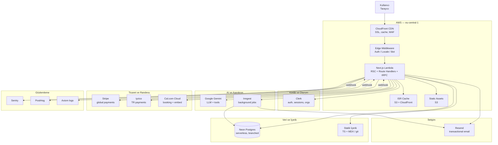
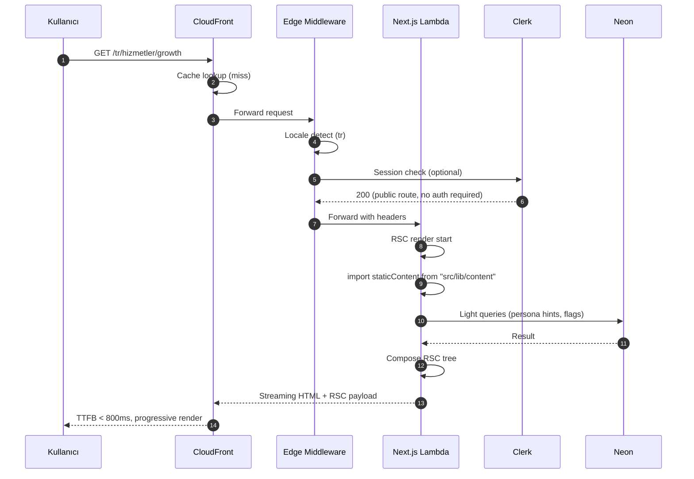
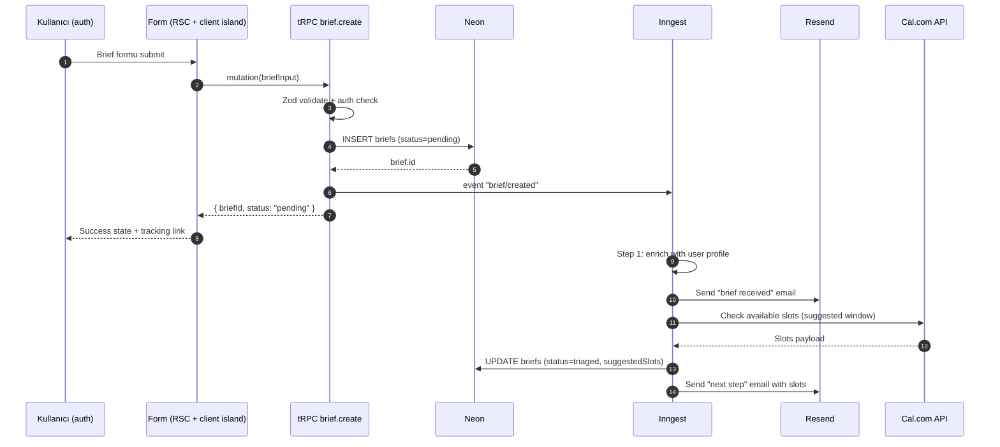
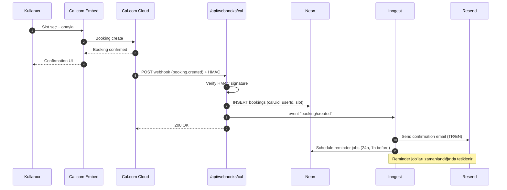
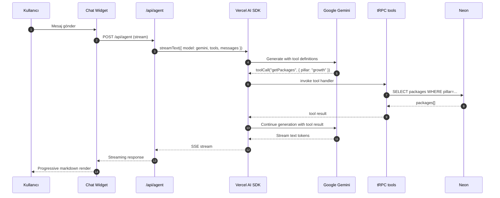
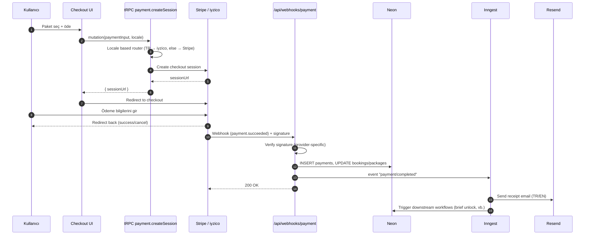

# 05 — Teknik Mimari

> **Amaç:** INDOLES kurumsal web platformunun üretim ortamına çıkacak teknik temelini, bileşen sınırlarını, veri akışlarını ve operasyonel modelini tek bir referans belgede sabitlemek.
>
> **Statü:** Onaylı — implementasyon için kaynak doküman.
> **Bağlı belgeler:** `04-design-system-principles.md`, `docs/decisions/ADR-001-agent-orchestration.md`, `docs/decisions/ADR-002-stitch-design-reject.md`.

> **Son güncelleme:** 2026-04-17 — ADR-006 kapsamında Sanity referansları kaldırıldı; içerik artık statik TS + MDX ile tutulur.

---

## 1. Mimari Özeti ve Kararlar

### 1.1 Tek cümlede
INDOLES web, **AWS üzerinde SST + OpenNext ile deploy edilen, TypeScript tabanlı tek Next.js 15 monolitidir**; AI agent ve tRPC API aynı deploymentın parçasıdır, içerik katmanı git içinde statik TS + MDX olarak tutulur (ADR-006).

### 1.2 Üst düzey prensipler
- **Monolit ile başla.** Tek Next.js projesi; ayrı servisleri ancak yük veya ekip büyümesi zorladığında böl. Mikroservis borcunu erken alma.
- **TypeScript her yerde.** Frontend, API, AI agent, Inngest fonksiyonları, statik içerik tanımları — tek dil, tek tip sistemi.
- **Edge'i dar tut.** Middleware edge'de çalışır (auth check, locale redirect, bot detection). RSC, Route Handler ve tRPC procedure'ları Node runtime'da kalır; Lambda'nın stabilitesi ve SDK uyumluluğu bu katmanda kritik.
- **Serverless-first.** Ölçeklenen bileşenler (Neon, Lambda, S3, CloudFront) scale-to-zero veya event-driven. Sabit sunucu yok.
- **Tek deployment artifact.** `sst deploy` tek komutla Next.js + tüm Lambda fonksiyonlarını + CDN'i yönetir; ayrı worker deploy pipeline'ı yok.
- **Observability gün sıfırdan.** Sentry (hata), PostHog (ürün analitiği), Axiom (log), CloudWatch (altyapı metrikleri) baştan bağlı.
- **Güvenlik standardı yüksek.** Clerk auth, SST Secrets, Content-Security-Policy, rate limiting ilk sürümden itibaren aktif.

### 1.3 Kararların özeti

| Karar alanı | Seçim | Reddedilen alternatif(ler) |
|---|---|---|
| Deploy hedefi | AWS (SST Ion + OpenNext) | Vercel, Railway, Fly.io |
| Bölge | `eu-central-1` (Frankfurt) | `us-east-1`, `eu-west-1` |
| Framework | Next.js 15 App Router | Remix, Astro, SvelteKit |
| Monorepo | **Yok** — tek Next.js projesi | Turborepo, Nx, pnpm workspaces |
| Veritabanı | Neon (serverless Postgres) | Supabase, RDS Postgres, PlanetScale |
| ORM | Drizzle | Prisma, Kysely |
| API | tRPC (domain routers) + Raw Route Handlers | REST, GraphQL, ayrı Hono servisi |
| AI orkestrasyon | Vercel AI SDK + Google Gemini | LangGraph, custom orchestrator, OpenAI |
| Auth | Clerk | Auth.js, Supabase Auth, custom |
| İçerik | Statik TS + MDX (git-in-content) | Sanity, Contentful, Payload, Strapi — bkz. ADR-006 |
| Randevu | Cal.com Cloud (API + embed) | Cal.com self-hosted, Calendly, custom |
| Ödeme | Stripe (global) + iyzico (TR) | Tek sağlayıcı |
| Background jobs | Inngest | BullMQ, AWS SQS + Lambda |
| E-posta | Resend + React Email | SendGrid, Postmark, SES doğrudan |
| Observability | Sentry + PostHog + Axiom | Datadog, New Relic |
| Test | Vitest + Playwright | Jest, Cypress |
| CI/CD | GitHub Actions | CircleCI, GitLab CI |
| Environment stratejisi | Development → Preview (per-PR) → Production | Ek staging ortamı |

Reddedilen kararların ek gerekçeleri: `ADR-001-agent-orchestration.md` (Vercel AI SDK seçimi), `ADR-002-stitch-design-reject.md` (Stitch tasarım kararlarının reddi).

---

## 2. Sistem Topolojisi

### 2.1 Topoloji diyagramı



### 2.2 Katman sınırları

- **Edge katmanı** — CloudFront + Lambda@Edge/Middleware. Yalnızca auth check, locale redirect (`tr`/`en`), bot detection/user-agent triage ve basit redirect yazılır. Veri erişimi yok.
- **Uygulama katmanı** — Next.js Lambda (Node.js runtime). RSC, Route Handlers, tRPC procedure'ları, AI agent handler'ı burada çalışır. Tüm veri erişimi, entegrasyon, iş kuralı bu katmanda.
- **Veri katmanı** — Neon (transactional), Clerk (identity store), statik dosyalar (content — bkz. ADR-006). Her biri kendi sınırında; cross-store join'ler uygulama katmanında yapılır.
- **Asenkron katman** — Inngest. E-posta gönderimi, Cal.com randevu onay akışı, ödeme receipt oluşturma, periyodik görevler.
- **Üçüncü taraf entegrasyonlar** — Cal.com Cloud, Stripe, iyzico, Google Gemini. Webhook ile inbound, API ile outbound.
- **Observability katmanı** — Sentry, PostHog, Axiom ayrı kanallardan beslenir; tek bir "logging gateway" yok.

---

## 3. Akış Şemaları

### 3.1 Request lifecycle



### 3.2 Brief gönderim akışı



### 3.3 Rezervasyon akışı



### 3.4 AI chatbot tool call akışı



### 3.5 İçerik güncelleme ve revalidate

ADR-006 kapsamında Sanity kaldırıldığı için webhook tabanlı ISR revalidate kaldırıldı. İçerik `src/lib/content/*.ts` ve `content/yazilar/*.mdx` içinde statik tutulur.

İçerik güncellenirken: (1) ilgili `.ts` veya `.mdx` dosyası git üzerinden güncellenir, (2) PR ile `main`'e merge edilir, (3) production deploy otomatik tetiklenir — yeni build içeriği alır.

Bir sayfayı hızlıca güncellenmesi gerektiğinde (acil düzeltme) `revalidatePath` veya `revalidateTag` manuel olarak admin panelden veya bir Route Handler üzerinden tetiklenebilir; Sanity webhook'una gerek yoktur.

### 3.6 Ödeme akışı



---

## 4. Teknoloji Yığını (detay)

### 4.1 Framework ve dil
- **Next.js 15 App Router** — RSC varsayılan, client island'lar `"use client"` ile opt-in. Streaming, parallel routes, intercepting routes kullanılacak.
- **TypeScript strict** — `strict: true`, `noUncheckedIndexedAccess: true`, `exactOptionalPropertyTypes: true`. `any` yasak, `unknown` + type narrowing tercih.
- **React 19** — Server Actions, `use()` hook, form actions. Server Actions'ı dışarıya maruz bırakan yerlerde rate limiting + Zod validation zorunlu.

### 4.2 Styling ve design system
- **Tailwind CSS v4** — `lib/design/tokens.ts` üzerinden konfigüre; manuel `tailwind.config.ts` minimum, token'lar tek kaynak.
- **CSS variables** — Dark mode opsiyonu için değil (şu an light-only), dinamik marka rengi override'ı için hazır.
- **Radix UI primitives** — Dialog, Popover, Tooltip, Dropdown. Headless — kendi design system'imizle sarılır.
- **Class Variance Authority (`cva`)** — Component variant API'si. `Button`, `Badge`, `Card` vb. variant'ları cva ile tanımlanır.
- **Framer Motion** — Sadece gerçek değer katan yerlerde (page transitions, scroll-triggered reveal, modal enter/exit). Dekoratif animasyon yasak (bkz. 04).

### 4.3 Veri katmanı
- **Neon Postgres** — Serverless, scale-to-zero. Production branch + her PR için otomatik preview branch.
- **Drizzle ORM** — Şema `src/server/db/schema.ts`, migration `drizzle-kit generate` + `drizzle-kit migrate`. Edge uyumlu driver (`@neondatabase/serverless`).
- **Connection pooling** — Neon'un built-in pooler'ı (`pgbouncer` modu) kullanılır; Lambda cold start'ta bağlantı maliyeti minimum.

### 4.4 API ve sunucu katmanı
- **tRPC v11** — Domain bazlı router'lar: `booking`, `brief`, `consultant`, `user`, `package`, `tool`. `createTRPCRouter` + `protectedProcedure` / `publicProcedure` / `adminProcedure`.
- **Zod** — Tüm input validation. Drizzle şeması + Zod arasında `drizzle-zod` ile sync.
- **Raw Route Handlers** — Yalnızca aşağıdakiler için:
  - `/api/webhooks/*` (Cal.com, Stripe, iyzico, Clerk) — imza doğrulama, raw body parse
  - `/api/upload/*` — multipart/form-data, S3 presigned URL
  - `/api/agent` — AI streaming (SSE)
  - `/api/auth/*` — Clerk callback'leri (kütüphane gereksinimi)

### 4.5 Kimlik ve yetkilendirme
- **Clerk** — Session, MFA, sosyal login, organization. Webhook ile user event'ları Neon'a sync edilir (`user.created`, `user.updated`, `user.deleted`).
- **Rol modeli** — `user`, `consultant`, `admin` (detay: `09-auth-roles-permissions.md`). tRPC middleware ile procedure bazında kontrol.
- **Session stratejisi** — Clerk JWT; server'da `auth()` helper'ı üzerinden `userId` + `orgId` + `role` çıkarılır.

### 4.6 AI katmanı
- **Vercel AI SDK** — `streamText`, `generateObject`, `tool` helper'ları. Gerekçe: `ADR-001`.
- **Google Gemini** — Model seçimi: `gemini-1.5-pro` (kalite) veya `gemini-1.5-flash` (düşük maliyet/hız). Router logic: kısa Q&A → flash, brief triage → pro.
- **Tool definitions** — `lib/ai/tools/*.ts`. Her tool Zod schema + handler. Örnek: `getPackages`, `getConsultantAvailability`, `createBriefDraft`, `searchCaseStudies`.
- **Guardrails** — System prompt'ta INDOLES ton rehberi (bkz. `03-brand-voice-tone.md`). PII maskeleme, prompt injection filtresi middleware'de.

### 4.7 İçerik katmanı

ADR-006 kapsamında Sanity kaldırıldı; içerik git içinde statik TS ve MDX dosyalarında tutulur.

| İçerik türü | Konum |
|---|---|
| Hizmetler (12 adet) | `src/lib/content/services.ts` |
| Pillar'lar | `src/lib/content/pillars.ts` |
| Paketler | `src/lib/content/packages.ts` |
| Vaka çalışmaları | `src/lib/content/cases.ts` |
| Danışmanlar | `src/lib/content/consultants.ts` |
| Blog / journal yazıları | `content/yazilar/{slug}.{tr,en}.mdx` |
| Sayfa içerikleri (hakkımızda, manifesto) | `messages/{tr,en}.json` |
| KVKK / yasal metinler | `content/hukuki/*.md` |
| Görseller | `public/images/` |

- **TypeScript tipler** — İçerik şemaları `src/lib/content/types.ts`'de tanımlanır; Sanity typegen veya GROQ yoktur, doğrudan TS importlar kullanılır.
- **Preview:** Sanity Presentation tool kaldırıldı. İçerik değişiklikleri git branch üzerinden izlenir; gerektiğinde Next.js draft mode ile preview branch'te incelenebilir.

### 4.8 Randevu ve iletişim
- **Cal.com Cloud** — Her consultant için event type. API ile uygun slot sorgulama, embed ile inline booking UI.
- **Webhook** — `BOOKING_CREATED`, `BOOKING_RESCHEDULED`, `BOOKING_CANCELLED` → `/api/webhooks/cal`.
- **Resend** — Transactional email. React Email ile template'ler; `emails/` klasöründe TSX dosyaları.
- **E-posta tipleri** — Welcome, brief confirmation, booking confirmation/reminder/cancellation, payment receipt, weekly digest (opsiyonel).

### 4.9 Ödeme
- **Stripe Checkout** — Global ödemeler. Checkout Session mode, webhook `checkout.session.completed`.
- **iyzico** — TR kullanıcıları. Checkout Form API, webhook benzeri callback (`conversationId` ile eşleme).
- **Routing** — Kullanıcının `locale` + billing country kombinasyonuna göre. Opt-out yok; biz yönlendiriyoruz.
- **Para birimi** — Stripe için `EUR`/`USD`, iyzico için `TRY`. Katalog fiyatları statik TS'te (`src/lib/content/packages.ts`) tüm birimlerde saklanır.

### 4.10 Background jobs
- **Inngest** — Event driven. Fonksiyonlar `src/lib/inngest/functions/*.ts`, her biri `inngest.createFunction(...)`.
- **Job tipleri**:
  - `brief.triage` — Brief geldiğinde enrichment + otomatik öneri
  - `booking.confirm` — Booking webhook sonrası onay akışı
  - `booking.reminder` — 24h + 1h önce hatırlatma
  - `payment.receipt` — Ödeme sonrası receipt email
  - `analytics.digest` — Haftalık admin özet (opsiyonel, v2)
- **Retry + dead letter** — Inngest built-in. Başarısız job'lar Sentry'ye alert atar.

### 4.11 Analitik ve observability
- **PostHog** — Ürün analitiği, funnel tracking, feature flags, session replay (opt-in). Self-host değil, EU Cloud.
- **Sentry** — Hata takibi + performance monitoring + replay. Server + client + edge.
- **Axiom** — Structured log aggregation. `console.log` yerine `logger.info({ ... })` pattern'i.
- **CloudWatch** — Lambda metrics, cold start, duration, error rate. SST native integration.

### 4.12 Test
- **Vitest** — Unit + integration. `*.test.ts` dosyaları, `tests/` klasörü altında test fixture'ları.
- **Playwright** — E2E. `tests/e2e/` altında; preview deployment URL'ine karşı çalışır. Critical path: anasayfa, brief submit, booking, checkout, login.
- **Mock stratejisi** — Üçüncü taraf servisler test ortamında stub'lanır (MSW); Neon için isolated test branch.

---

## 5. Deploy ve Altyapı

### 5.1 SST ile altyapı

Altyapı tamamen `sst.config.ts` içinde kod olarak tanımlı. AWS resource'ları (CloudFront, Lambda, S3, Route 53) SST tarafından yönetilir; manuel console değişikliği yasak.

```typescript
/// <reference path="./.sst/platform/config.d.ts" />

export default $config({
  app(input) {
    return {
      name: "indoles-web",
      removal: input?.stage === "production" ? "retain" : "remove",
      home: "aws",
      providers: {
        aws: { region: "eu-central-1" },
      },
    };
  },
  async run() {
    // Secrets — SST Secrets Manager
    const neonDbUrl = new sst.Secret("NeonDatabaseUrl");
    const clerkPublishableKey = new sst.Secret("ClerkPublishableKey");
    const clerkSecretKey = new sst.Secret("ClerkSecretKey");
    const geminiApiKey = new sst.Secret("GoogleGeminiApiKey");
    const stripeSecretKey = new sst.Secret("StripeSecretKey");
    const iyzicoApiKey = new sst.Secret("IyzicoApiKey");
    const iyzicoSecretKey = new sst.Secret("IyzicoSecretKey");
    const resendApiKey = new sst.Secret("ResendApiKey");
    const inngestSigningKey = new sst.Secret("InngestSigningKey");
    const posthogKey = new sst.Secret("PosthogKey");
    const sentryDsn = new sst.Secret("SentryDsn");

    // Next.js site — OpenNext wrapper
    const site = new sst.aws.Nextjs("IndolesWeb", {
      domain: {
        name:
          $app.stage === "production"
            ? "indoles.com.tr"
            : `${$app.stage}.indoles.com.tr`,
        dns: sst.aws.dns({ zone: "indoles.com.tr" }),
      },
      environment: {
        DATABASE_URL: neonDbUrl.value,
        NEXT_PUBLIC_CLERK_PUBLISHABLE_KEY: clerkPublishableKey.value,
        CLERK_SECRET_KEY: clerkSecretKey.value,
        GOOGLE_GENERATIVE_AI_API_KEY: geminiApiKey.value,
        STRIPE_SECRET_KEY: stripeSecretKey.value,
        IYZICO_API_KEY: iyzicoApiKey.value,
        IYZICO_SECRET_KEY: iyzicoSecretKey.value,
        RESEND_API_KEY: resendApiKey.value,
        INNGEST_SIGNING_KEY: inngestSigningKey.value,
        NEXT_PUBLIC_POSTHOG_KEY: posthogKey.value,
        SENTRY_DSN: sentryDsn.value,
      },
    });

    return { url: site.url };
  },
});
```

### 5.2 Ortamlar

| Ortam | Stage adı | Domain | Neon branch | Amaç |
|---|---|---|---|---|
| Development | — (local) | `http://localhost:3000` | Dev branch (paylaşımlı) | Yerel geliştirme |
| Preview | `pr-{prNumber}` veya `preview` | `{stage}.indoles.com.tr` | Otomatik branch (PR başına) | PR review, stakeholder onay, E2E test |
| Production | `production` | `indoles.com.tr` + `www.indoles.com.tr` | `main` | Canlı |

Ayrı "staging" ortamı **yok**: Preview deployment her PR için otomatik ayağa kalkar ve üretim paritesinde çalışır.

### 5.3 Secrets yönetimi

- **Geliştirme** — `.env.local` (git-ignored). Ekip paylaşımı için 1Password (varsayılan, v1).
- **Preview + Production** — SST Secrets. `sst secret set NeonDatabaseUrl --stage production` ile set edilir.
- **Rotation** — Üretim secret'ları çeyrek bazında rotate edilir; rotation checklist `docs/runbooks/secret-rotation.md` (henüz yazılmadı).

### 5.4 Domain ve DNS
- **Route 53 hosted zone:** `indoles.com.tr`.
- **Production:** `indoles.com.tr` + `www.indoles.com.tr` (WWW → apex 301 redirect).
- **Preview:** `{stage}.indoles.com.tr` — wildcard subdomain.
- **SSL:** ACM sertifikası SST tarafından otomatik provision.

---

## 6. Rendering Stratejisi

Next.js App Router'da her route için rendering modu tek tek belirlenir. Varsayılan yoksa RSC + dynamic; kural şu tabloya göre:

| Route grubu | Örnek path | Mod | Revalidate | Gerekçe |
|---|---|---|---|---|
| Marketing anasayfa | `/[locale]` | SSR (persona-aware) | — | Kullanıcı cookie'sine göre persona varyantı; cache'lenemez. |
| Hizmet / pillar sayfaları | `/[locale]/hizmetler/[slug]` | ISR | 86400s | Statik içerik stabil; içerik değişimi git deploy ile gelir. |
| Paket detay | `/[locale]/paketler/[slug]` | ISR | 3600s | Fiyat/kapsam orta sıklıkta değişir. |
| Case study | `/[locale]/vakalar/[slug]` | ISR | 86400s | Yayınlandıktan sonra nadiren değişir. |
| Blog / içerik | `/[locale]/yazilar/[slug]` | ISR | 86400s | SEO-odaklı; statik MDX üretim yeterli. |
| Dashboard | `/app/dashboard` | SSR | — | Kullanıcıya özel; auth-gated. |
| Brief formu | `/app/brief/yeni` | SSR + client island | — | Form state client-side, SSR shell. |
| Rezervasyon | `/app/rezervasyon` | SSR | — | Cal.com embed auth-aware. |
| Admin | `/admin/**` | SSR | — | Her zaman güncel data. |
| API | `/api/**` | Route Handler (dynamic) | — | — |

**Streaming kuralı:** RSC render'ları `<Suspense>` ile parçalanır; shell 200ms içinde gönderilmeye başlar, data-heavy bölümler streaming ile gelir.

**`generateStaticParams`:** ISR sayfaları için build time'da `src/lib/content/*.ts` dosyalarından slug listesi alınır; kritik sayfalar (pillar'lar, öne çıkan case study'ler) pre-render.

---

## 7. API Katmanı

### 7.1 tRPC router yapısı

```
src/server/
  trpc.ts                  # createTRPCRouter, middleware'ler (auth, admin, rate limit)
  context.ts               # ctx: { db, auth, session }
  routers/
    _app.ts                # tüm router'ları birleştirir
    booking.ts             # create, list, cancel, reschedule
    brief.ts               # create, list, getById, update
    consultant.ts          # list, getBySlug, availability
    user.ts                # me, updateProfile, deleteAccount
    package.ts             # list, getBySlug, pricing
    tool.ts                # AI agent'in çağırdığı iç tool'lar
```

### 7.2 Örnek router (`brief.ts`)

```typescript
import { z } from "zod";
import { createTRPCRouter, protectedProcedure } from "../trpc";
import { briefs } from "@/server/db/schema";
import { eq, desc } from "drizzle-orm";
import { TRPCError } from "@trpc/server";
import { inngest } from "@/lib/inngest";

export const briefRouter = createTRPCRouter({
  create: protectedProcedure
    .input(
      z.object({
        companyName: z.string().min(2).max(200),
        sector: z.string().min(2),
        problemDescription: z.string().min(50).max(5000),
        budget: z.enum(["small", "medium", "large"]),
        timeline: z.enum(["urgent", "normal", "flexible"]),
        preferredPillar: z.enum(["growth", "transform", "build"]).optional(),
        attachmentUrls: z.array(z.string().url()).max(5).optional(),
      })
    )
    .mutation(async ({ ctx, input }) => {
      const [brief] = await ctx.db
        .insert(briefs)
        .values({
          userId: ctx.auth.userId,
          ...input,
          status: "pending",
        })
        .returning();

      await inngest.send({
        name: "brief/created",
        data: { briefId: brief.id, userId: ctx.auth.userId },
      });

      return brief;
    }),

  list: protectedProcedure.query(async ({ ctx }) => {
    return ctx.db
      .select()
      .from(briefs)
      .where(eq(briefs.userId, ctx.auth.userId))
      .orderBy(desc(briefs.createdAt));
  }),

  getById: protectedProcedure
    .input(z.object({ id: z.string().uuid() }))
    .query(async ({ ctx, input }) => {
      const [brief] = await ctx.db
        .select()
        .from(briefs)
        .where(eq(briefs.id, input.id))
        .limit(1);

      if (!brief || brief.userId !== ctx.auth.userId) {
        throw new TRPCError({ code: "NOT_FOUND" });
      }

      return brief;
    }),
});
```

Her mutation'da: (1) Zod validation, (2) auth/ownership check, (3) DB yazma, (4) event emit (gerekiyorsa), (5) dönüş.

### 7.3 Middleware katmanları
- **`loggingMiddleware`** — Her procedure için structured log (Axiom).
- **`authMiddleware`** — `protectedProcedure` için Clerk session zorunlu.
- **`adminMiddleware`** — `adminProcedure` için rol kontrolü.
- **`rateLimitMiddleware`** — `brief.create`, `booking.create`, `payment.createSession` için. v1: in-memory LRU; v2: Upstash Redis.

### 7.4 Raw Route Handler'lar

Aşağıdakiler tRPC dışında, klasik Route Handler:

| Path | Amaç | Özellik |
|---|---|---|
| `/api/webhooks/cal` | Booking event | HMAC verify, booking upsert, Inngest trigger |
| `/api/webhooks/stripe` | Payment event | Stripe signature verify, payment upsert |
| `/api/webhooks/iyzico` | Payment event | iyzico conversation ID match |
| `/api/webhooks/clerk` | User sync | Svix signature verify, Neon user upsert |
| `/api/webhooks/inngest` | Inngest function ingress | Inngest signing key verify |
| `/api/upload` | Dosya yükleme | S3 presigned URL generate |
| `/api/agent` | AI chatbot | SSE stream, Vercel AI SDK |
| `/api/health` | Health check | DB ping, external service ping (opsiyonel) |

---

## 8. Entegrasyonlar

| Servis | Kullanım | Entegrasyon tipi | Kimlik doğrulama |
|---|---|---|---|
| Neon | Transactional DB | `@neondatabase/serverless` + Drizzle | Connection string (SST Secret) |
| Clerk | Auth | `@clerk/nextjs` + webhook | Publishable + secret key + Svix signature |
| Google Gemini | LLM | Vercel AI SDK (`@ai-sdk/google`) | API key |
| Cal.com | Booking | REST API + `@calcom/embed-react` + webhook | API key + HMAC webhook secret |
| Stripe | Global payment | `stripe-node` + webhook | Secret key + webhook signing secret |
| iyzico | TR payment | `iyzipay-node` + callback | API key + secret key |
| Resend | Email | `resend-node` + React Email templates | API key |
| Inngest | Background jobs | `inngest` SDK + webhook ingress | Signing key |
| PostHog | Analytics | `posthog-js` (client) + `posthog-node` (server) | Project API key |
| Sentry | Error tracking | `@sentry/nextjs` | DSN |
| Axiom | Logs | `@axiomhq/js` | API token |

Her entegrasyon için `src/lib/<service>/` altında:
- `client.ts` — konfigüre edilmiş SDK instance
- `types.ts` — domain tiplerine mapping
- `index.ts` — public API

---

## 9. Güvenlik

### 9.1 Authentication
Clerk üzerinden. Session cookie HTTP-only + Secure + SameSite=Lax. MFA opsiyonel ama admin rolü için zorunlu olarak işaretlenir (Clerk dashboard).

### 9.2 Authorization
- tRPC procedure bazında (`protectedProcedure`, `adminProcedure`).
- Row-level ownership check: Her query `userId = ctx.auth.userId` filtresi içerir veya aksi açıkça policy'de yazılır.
- Admin panelinde path-level guard: `middleware.ts` + RSC layout'ta role check.

### 9.3 Input validation
- Her tRPC procedure Zod schema ile korunur.
- Raw Route Handler'lar `zod-validation-error` ile 400 döner.
- File upload: MIME + magic number check (server-side), max 10MB, taranacak uzantılar.

### 9.4 Secrets
- Asla kod içinde hardcoded.
- `.env.local` git-ignored, örnekleri `.env.example`'da yalnızca anahtar adları.
- SST Secrets üzerinden Lambda env injection.

### 9.5 Network + HTTP headers
- **CSP (Content-Security-Policy):** `default-src 'self'`; `script-src` Clerk + PostHog + Sentry + Cal embed; `frame-src` Cal.com + Stripe Checkout + iyzico.
- **HSTS:** `max-age=63072000; includeSubDomains; preload`.
- **X-Frame-Options:** `DENY` (studio hariç).
- **Referrer-Policy:** `strict-origin-when-cross-origin`.
- **Permissions-Policy:** gereksiz API'ler disable.

### 9.6 Rate limiting
- `brief.create`, `booking.create`, `payment.createSession`, `/api/agent` — kullanıcı ve IP bazında.
- v1: Lambda memory LRU (best-effort, cold start'ta reset).
- v2: Upstash Redis ile distributed.

### 9.7 Webhook güvenliği
Her webhook endpoint'i **raw body** okur, signature doğrular, timestamp skew kontrolü yapar (5 dakika). Doğrulanmamış isteklere 401 döner, Sentry'e event atar.

### 9.8 KVKK + GDPR
- PII alanları Neon'da tagged (şema seviyesinde comment/metadata).
- "Hesabımı sil" akışı: kullanıcı → soft delete → 30 gün bekle → Inngest cleanup job → PII anonymize.
- Cookie banner: PostHog + Clerk analitik cookie'leri opt-in (EEA bölgesi için).

### 9.9 Kötü niyet ve botlar
- CloudFront WAF → OWASP Top 10 managed rule set.
- Middleware'de bilinen kötü bot UA'ları block.
- Form endpoint'lerine honeypot field + Cloudflare Turnstile (public form'lar: iletişim, brief).

---

## 10. Performans ve Core Web Vitals

### 10.1 Hedefler (75p)

| Metrik | Hedef | Kritik eşik (alarm) |
|---|---|---|
| LCP | < 1.8s | > 2.5s |
| INP | < 150ms | > 200ms |
| CLS | < 0.05 | > 0.1 |
| TTFB | < 600ms | > 1s |
| FCP | < 1.2s | > 1.8s |

### 10.2 Stratejiler
- **RSC default** — JS bundle'ı müşteriye göndermemek ilk çözüm.
- **Client island'ları izole et** — Form, embed, animasyon ihtiyaç duyanlar `"use client"`; diğer her şey server.
- **Image optimization** — Next.js `<Image>` + `/public/images/` statik asset'ler [gelecekte CDN kararı — şimdilik `/public`]. AVIF/WebP otomatik.
- **Font strategy** — Fraunces + Inter self-host (`next/font`). `display: swap`, subset TR + EN + Latin Extended.
- **Preconnect + preload** — CloudFront, Clerk, PostHog origin'lerine `preconnect`; LCP image `preload`.
- **Code splitting** — Route bazlı otomatik; manuel `dynamic()` ile büyük client bileşenler (chart, editor) lazy.
- **ISR + CDN** — ISR sayfaları CloudFront cache'te; cold start'a hit etmez.
- **Edge middleware dar** — Sadece redirect + auth check; veri erişimi yasak.

### 10.3 Monitoring
- **PostHog Web Vitals** — Real User Monitoring (RUM).
- **Sentry Performance** — Transaction traces, yavaş DB query'leri.
- **Lighthouse CI** — GitHub Actions'ta her PR için; eşik altına düşerse warn (block değil).

---

## 11. Klasör Yapısı

```
indoles-web/
├── .github/
│   └── workflows/
│       ├── preview.yml           # PR açıldığında sst deploy --stage pr-{n}
│       ├── production.yml        # main'e merge → sst deploy --stage production
│       └── checks.yml            # lint, typecheck, test, lighthouse
├── .claude/                      # Claude Code plugin ayarları, skill'ler
├── content/
│   ├── yazilar/                  # Blog yazıları — {slug}.{tr,en}.mdx
│   └── hukuki/                   # KVKK / yasal metinler — *.md
├── docs/                         # Bu klasör
├── public/
│   └── images/                   # Statik görseller
├── src/
│   ├── app/
│   │   ├── (marketing)/
│   │   │   └── [locale]/
│   │   │       ├── layout.tsx
│   │   │       ├── page.tsx                    # Anasayfa
│   │   │       ├── hizmetler/[slug]/page.tsx
│   │   │       ├── paketler/[slug]/page.tsx
│   │   │       ├── vakalar/[slug]/page.tsx
│   │   │       ├── yazilar/[slug]/page.tsx
│   │   │       └── iletisim/page.tsx
│   │   ├── (auth)/
│   │   │   └── app/
│   │   │       ├── layout.tsx                  # Auth-gated shell
│   │   │       ├── dashboard/page.tsx
│   │   │       ├── brief/yeni/page.tsx
│   │   │       ├── rezervasyon/page.tsx
│   │   │       └── hesap/page.tsx
│   │   ├── (admin)/
│   │   │   └── admin/
│   │   │       ├── layout.tsx
│   │   │       ├── briefs/page.tsx
│   │   │       ├── bookings/page.tsx
│   │   │       └── users/page.tsx
│   │   ├── api/
│   │   │   ├── trpc/[trpc]/route.ts
│   │   │   ├── agent/route.ts                  # AI streaming
│   │   │   ├── upload/route.ts
│   │   │   ├── health/route.ts
│   │   │   └── webhooks/
│   │   │       ├── cal/route.ts
│   │   │       ├── stripe/route.ts
│   │   │       ├── iyzico/route.ts
│   │   │       ├── clerk/route.ts
│   │   │       └── inngest/route.ts
│   │   ├── layout.tsx                          # Root layout (html, body)
│   │   └── not-found.tsx
│   ├── components/
│   │   ├── ui/                   # Radix-wrapped primitives (Button, Input, Dialog)
│   │   ├── editorial/            # Design-system komponentleri (Heading, Quote, Number)
│   │   ├── layout/               # Header, Footer, Nav, Sidebar
│   │   ├── marketing/            # Hero, CaseStudyGrid, PackageCard, PricingTable
│   │   ├── dashboard/            # BriefCard, BookingList, MetricTile
│   │   └── shared/               # LocaleSwitcher, ChatWidget
│   ├── lib/
│   │   ├── design/
│   │   │   └── tokens.ts         # Tasarım token'ları (tek kaynak)
│   │   ├── trpc/                 # Client-side helpers
│   │   ├── auth/                 # Clerk wrapper, role helpers
│   │   ├── ai/
│   │   │   ├── tools/            # AI agent'in kullandığı tool'lar
│   │   │   ├── prompts/          # System prompt'lar
│   │   │   └── agent.ts          # streamText konfigürasyonu
│   │   ├── payments/
│   │   │   ├── stripe.ts
│   │   │   ├── iyzico.ts
│   │   │   └── router.ts         # Locale → provider routing
│   │   ├── email/
│   │   │   ├── client.ts         # Resend wrapper
│   │   │   └── templates/        # React Email TSX
│   │   ├── analytics/
│   │   │   ├── posthog.ts
│   │   │   └── events.ts         # Typed event definitions
│   │   ├── content/              # Statik içerik tanımları (ADR-006)
│   │   │   ├── types.ts          # İçerik şema tipleri
│   │   │   ├── services.ts
│   │   │   ├── pillars.ts
│   │   │   ├── packages.ts
│   │   │   ├── cases.ts
│   │   │   └── consultants.ts
│   │   ├── inngest/
│   │   │   ├── client.ts
│   │   │   └── functions/
│   │   └── utils/                # cn, formatDate, slugify vb.
│   ├── server/
│   │   ├── db/
│   │   │   ├── schema.ts         # Drizzle şemaları
│   │   │   ├── index.ts          # db client
│   │   │   └── migrations/       # drizzle-kit output
│   │   ├── trpc.ts
│   │   ├── context.ts
│   │   └── routers/
│   │       ├── _app.ts
│   │       ├── booking.ts
│   │       ├── brief.ts
│   │       ├── consultant.ts
│   │       ├── user.ts
│   │       ├── package.ts
│   │       └── tool.ts
│   ├── middleware.ts             # Edge middleware (Clerk + locale)
│   └── styles/
│       └── globals.css
├── tests/
│   ├── unit/
│   ├── integration/
│   └── e2e/
├── .env.example
├── .gitignore
├── CLAUDE.md
├── README.md
├── drizzle.config.ts
├── next.config.ts
├── package.json
├── playwright.config.ts
├── postcss.config.mjs
├── sst.config.ts
├── tailwind.config.ts
├── tsconfig.json
└── vitest.config.ts
```

---

## 12. CI/CD, Runbook ve Açık Sorular

### 12.1 GitHub Actions pipeline

**`checks.yml`** — Her PR'da:
```
1. Checkout + Node 20 setup + pnpm install (frozen lockfile)
2. Lint — eslint + prettier check
3. Typecheck — tsc --noEmit
4. Test — vitest run
5. Build — next build
6. Lighthouse CI (opsiyonel, warn-only)
```

**`preview.yml`** — PR açıldığında/güncellendiğinde:
```
1. checks.yml geçtikten sonra
2. Neon branch oluştur (preview)
3. sst deploy --stage pr-{prNumber}
4. Playwright E2E (critical path) preview URL'e karşı
5. PR'a preview URL + test raporu yorumu düş
```

**`production.yml`** — `main`'e merge:
```
1. checks.yml geç
2. Drizzle migration — production Neon branch'e apply
3. sst deploy --stage production
4. Sentry release bildir (source map upload)
5. Smoke test (homepage + health endpoint)
6. PostHog'a release annotation
```

### 12.2 Runbook başlıkları (ayrı belge: `docs/runbooks/`)
- **Incident response** — Üretim down/yavaş durumunda kim bakar, hangi dashboard'a.
- **Secret rotation** — Clerk/Stripe/iyzico/Gemini key rotation prosedürü.
- **Data export / user deletion** — KVKK/GDPR talebi geldiğinde adım adım.
- **Neon PITR (point-in-time recovery)** — Veri kaybı senaryosunda.

### 12.3 Açık sorular

| # | Soru | Önerilen v1 cevabı | Ne zaman karar? |
|---|---|---|---|
| 1 | Rate limit store: in-memory LRU mu, Upstash Redis mi? | v1: in-memory. v2: Upstash. | v1 launch sonrası trafik metriklerine göre |
| 2 | Paylaşımlı secret dağıtımı: 1Password mu, Doppler mı? | 1Password | Proje kickoff, 1 hafta içinde |
| 3 | CloudFront WAF managed rule set ötesinde custom rule gerek var mı? | Önce Managed rule ile başla | İlk 2 hafta RUM + log izleme sonrası |
| 4 | AI agent için conversation persistence (geçmiş sohbet) Neon'da mı, Redis'te mi? | Neon (audit + admin görünürlüğü için) | Bölüm 07 — AI agent spec yazımında netleşir |
| 5 | ISR revalidate sıklığı pillar sayfaları için 3600s yeterli mi yoksa webhook-only mu? | Webhook-only + uzun TTL (86400s) | İlk içerik sync cycle'dan sonra |
| 6 | Test datası için Neon branch reset stratejisi (her E2E run'dan önce seed) | Playwright global setup'ta fixture seed | İlk E2E senaryosu yazılırken |
| 7 | Feature flag: PostHog flags mı, başka? | PostHog flags (zaten var) | — |
| 8 | Cold start'ı azaltmak için provisioned concurrency gerekli mi? | Hayır (başlangıç) | Production RUM'da p95 TTFB > 1s olursa |

### 12.4 v2 için not edilmesi gereken mimari konular
- **Multi-region read replica** (Neon) — TR + EU kullanıcı büyüdüğünde.
- **Edge function'da RSC çalıştırma** — OpenNext'in olgunluk durumuna göre yeniden değerlendir.
- **AI model diversity** — Gemini dışında Claude veya OpenAI backup routing.
- **Ayrı admin deployment** — Admin panel yükü arttığında `admin.indoles.com.tr` olarak ayrı Next.js projesine ayrılabilir.
- **Event sourcing** — Audit log hacmi büyürse Neon → S3 + Athena.

---

## Ek — Terminoloji

- **RSC:** React Server Components
- **ISR:** Incremental Static Regeneration
- **OpenNext:** Next.js'i AWS Lambda'ya deploy eden açık kaynak adaptör
- **SST (Ion):** AWS IaC framework, Pulumi tabanlı
- **tRPC:** TypeScript end-to-end type-safe RPC
- **RUM:** Real User Monitoring
- **PITR:** Point-in-Time Recovery
