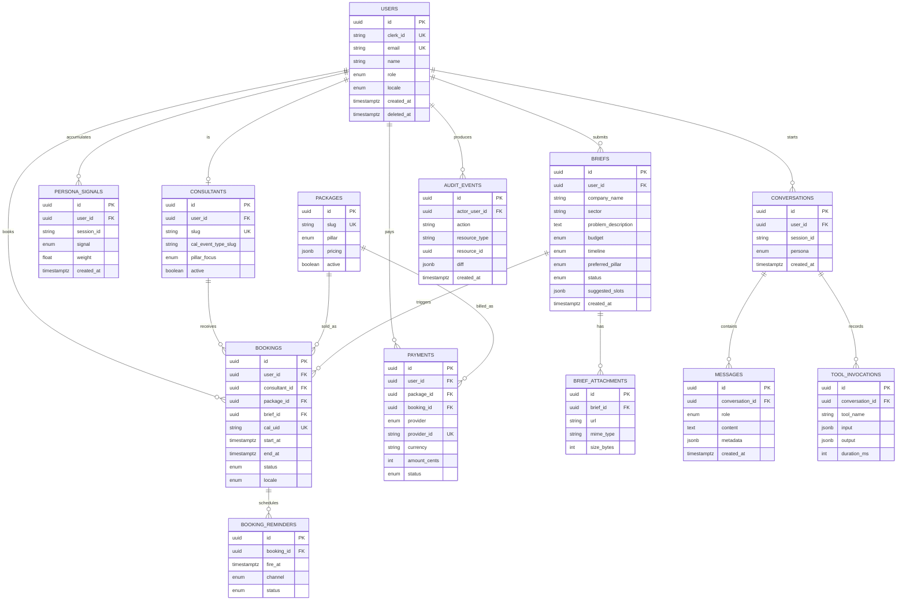

# 06 — Veri Modeli

> **Amaç:** Neon Postgres üzerinde tutulacak entity'leri, ilişkilerini ve index stratejisini sabitlemek. Statik içerik dosyalarından farkı: burada **state** tutulur (kullanıcı, brief, booking, payment), statik TS/MDX dosyalarında **content** tutulur (page, caseStudy, article — bkz. ADR-006).
>
> **ORM:** Drizzle — şema `src/server/db/schema.ts` tek dosyada başlar; domain büyürse klasörlenir.
> **ID stratejisi:** `gen_random_uuid()` (pgcrypto) v1 için; v2'de uuid v7 değerlendirilecek. Dışarıya açılan (URL, API) ID'ler uuid; kullanıcı-dostu kısa slug'lar ayrı sütun.

---

## 1. Entity Haritası

---

## 2. Tablo Detayları

### 2.1 `users`
Clerk kullanıcılarının Neon'daki mirror'ı. Webhook (`/api/webhooks/clerk`) ile upsert edilir. Tüm domain entity'leri `user_id` ile bu tabloya bağlanır.

| Sütun | Tip | Kısıt | Not |
|---|---|---|---|
| `id` | uuid | PK, default `gen_random_uuid()` | Internal ID |
| `clerk_id` | text | UNIQUE, NOT NULL | `user_xxx` format |
| `email` | citext | UNIQUE, NOT NULL | Case-insensitive |
| `name` | text | NULL | Ad + soyad combined |
| `role` | enum | NOT NULL, default `user` | `user` / `consultant` / `admin` |
| `locale` | enum | NOT NULL, default `tr` | `tr` / `en` |
| `marketing_opt_in` | boolean | NOT NULL, default false | KVKK/GDPR consent |
| `metadata` | jsonb | NOT NULL, default `{}` | Clerk extension alanları |
| `created_at` | timestamptz | NOT NULL, default `now()` | — |
| `updated_at` | timestamptz | NOT NULL, default `now()` | Trigger ile güncellenir |
| `deleted_at` | timestamptz | NULL | Soft delete; 30 gün sonra Inngest job anonymize eder |

**Index'ler:** `(clerk_id)`, `(email)`, `(role) WHERE deleted_at IS NULL`.

### 2.2 `consultants`
Danışman profili. Faz 1'de iç ekip; açık marketplace yok (CLAUDE.md §6).

| Sütun | Tip | Kısıt | Not |
|---|---|---|---|
| `id` | uuid | PK | — |
| `user_id` | uuid | FK `users(id)`, UNIQUE | 1:1 |
| `slug` | text | UNIQUE, NOT NULL | `/danismanlar/[slug]` |
| `cal_event_type_slug` | text | NOT NULL | Cal.com embed'de kullanılır |
| `pillar_focus` | enum[] | NOT NULL | `growth` / `transform` / `build` |
| `expertise_tags` | text[] | NOT NULL | Filtreleme için |
| `active` | boolean | NOT NULL, default true | — |
| `display_order` | int | NOT NULL, default 0 | Vitrin sıralaması |

**Index'ler:** `(slug)`, `(active, display_order)`.

### 2.3 `packages`
Ürünleşmiş paketler. Sabit kapsam + sabit süre + sabit fiyat. İçerik ve pazarlama copy'si `src/lib/content/packages.ts`'de (statik TS — ADR-006); state (aktif mi, kaç satıldı, o anki fiyat override'ı) Neon'da.

| Sütun | Tip | Kısıt | Not |
|---|---|---|---|
| `id` | uuid | PK | — |
| `slug` | text | UNIQUE, NOT NULL | `/paketler/[slug]` — statik içerikle eşleştirilir |
| `pillar` | enum | NOT NULL | `growth` / `transform` / `build` |
| `pricing` | jsonb | NOT NULL | `{"TRY": 12000, "EUR": 450, "USD": 500}` |
| `active` | boolean | NOT NULL, default true | Satışa açık mı |
| `stripe_price_id` | text | NULL | Stripe tarafında önceden oluşturulan price |
| `iyzico_product_ref` | text | NULL | iyzico tarafında product ref |

**Index'ler:** `(slug)`, `(pillar, active)`.

### 2.4 `briefs`
Potansiyel müşteriden gelen detaylı proje özeti. Funnel'in yüksek taahhüt adımı.

| Sütun | Tip | Kısıt | Not |
|---|---|---|---|
| `id` | uuid | PK | — |
| `user_id` | uuid | FK `users(id)`, NOT NULL | Auth zorunlu |
| `company_name` | text | NOT NULL | 2-200 char |
| `sector` | text | NOT NULL | — |
| `problem_description` | text | NOT NULL | 50-5000 char |
| `budget` | enum | NOT NULL | `small` / `medium` / `large` |
| `timeline` | enum | NOT NULL | `urgent` / `normal` / `flexible` |
| `preferred_pillar` | enum | NULL | `growth` / `transform` / `build` |
| `status` | enum | NOT NULL, default `pending` | `pending` / `triaged` / `in_discussion` / `converted` / `declined` / `archived` |
| `suggested_slots` | jsonb | NULL | Inngest triage sonrası doldurulur |
| `assigned_consultant_id` | uuid | FK `consultants(id)`, NULL | Triage sonrası atanır |
| `source` | text | NULL | `ai_agent` / `form` / `email` / `referral` |
| `created_at` | timestamptz | NOT NULL, default `now()` | — |
| `updated_at` | timestamptz | NOT NULL, default `now()` | Trigger |

**Index'ler:** `(user_id, created_at DESC)`, `(status, created_at DESC)`, `(assigned_consultant_id) WHERE status IN ('pending','triaged','in_discussion')`.

### 2.5 `brief_attachments`
Brief formunda yüklenen dosyalar (max 5, S3'te tutulur).

| Sütun | Tip | Kısıt |
|---|---|---|
| `id` | uuid | PK |
| `brief_id` | uuid | FK `briefs(id)` ON DELETE CASCADE |
| `url` | text | NOT NULL |
| `filename` | text | NOT NULL |
| `mime_type` | text | NOT NULL |
| `size_bytes` | int | NOT NULL |
| `uploaded_at` | timestamptz | NOT NULL, default `now()` |

### 2.6 `bookings`
Cal.com üzerinden alınan rezervasyonların Neon kopyası. Cal.com "source of truth" olarak kalır ama admin görünürlüğü + domain event trigger için Neon'da sync tutulur.

| Sütun | Tip | Kısıt | Not |
|---|---|---|---|
| `id` | uuid | PK | — |
| `user_id` | uuid | FK `users(id)`, NOT NULL | — |
| `consultant_id` | uuid | FK `consultants(id)`, NOT NULL | — |
| `package_id` | uuid | FK `packages(id)`, NULL | Paket satın alındıysa |
| `brief_id` | uuid | FK `briefs(id)`, NULL | Brief'ten geldi ise |
| `cal_uid` | text | UNIQUE, NOT NULL | Cal.com booking UID |
| `cal_event_type_slug` | text | NOT NULL | Hangi event type |
| `start_at` | timestamptz | NOT NULL | — |
| `end_at` | timestamptz | NOT NULL | — |
| `status` | enum | NOT NULL | `confirmed` / `rescheduled` / `cancelled` / `completed` / `no_show` |
| `locale` | enum | NOT NULL | Email dil seçimi |
| `notes` | text | NULL | Kullanıcının booking sırasında girdiği not |
| `created_at` | timestamptz | NOT NULL, default `now()` | — |
| `updated_at` | timestamptz | NOT NULL, default `now()` | Webhook update |

**Index'ler:** `(user_id, start_at DESC)`, `(consultant_id, start_at)`, `(cal_uid)`, `(status, start_at)`.

### 2.7 `booking_reminders`
Inngest'in zamanladığı hatırlatma job'larının audit trail'i.

| Sütun | Tip | Kısıt |
|---|---|---|
| `id` | uuid | PK |
| `booking_id` | uuid | FK `bookings(id)` ON DELETE CASCADE |
| `fire_at` | timestamptz | NOT NULL |
| `channel` | enum | `email` / `sms` (sms v2) |
| `status` | enum | `scheduled` / `sent` / `failed` / `cancelled` |
| `sent_at` | timestamptz | NULL |

### 2.8 `payments`
Stripe ve iyzico ödeme kayıtlarının birleşik tablosu.

| Sütun | Tip | Kısıt | Not |
|---|---|---|---|
| `id` | uuid | PK | — |
| `user_id` | uuid | FK `users(id)`, NOT NULL | — |
| `package_id` | uuid | FK `packages(id)`, NULL | Paket ödemesi ise |
| `booking_id` | uuid | FK `bookings(id)`, NULL | Tekil rezervasyon ödemesi ise |
| `provider` | enum | NOT NULL | `stripe` / `iyzico` |
| `provider_id` | text | NOT NULL | `cs_xxx` (Stripe) veya `conversationId` (iyzico) |
| `currency` | char(3) | NOT NULL | `TRY` / `EUR` / `USD` |
| `amount_cents` | int | NOT NULL | Cents / kuruş |
| `status` | enum | NOT NULL | `pending` / `succeeded` / `failed` / `refunded` / `disputed` |
| `metadata` | jsonb | NOT NULL, default `{}` | Provider-specific payload snapshot |
| `created_at` | timestamptz | NOT NULL, default `now()` | — |
| `succeeded_at` | timestamptz | NULL | Webhook sonrası |

**Index'ler:** `(user_id, created_at DESC)`, `UNIQUE(provider, provider_id)`, `(status, created_at DESC)`.

### 2.9 `persona_signals`
Persona-driven homepage'in beslendiği tablo. Her ziyaretçinin sitedeki davranışından türeyen sinyaller — hangi pillar sayfasına girdi, hangi case study'i okudu, hangi eksen (Sanayi/Ticaret) CTA'sına tıkladı — burada toplanır ve persona çıkarımı yapılır.

| Sütun | Tip | Kısıt | Not |
|---|---|---|---|
| `id` | uuid | PK | — |
| `user_id` | uuid | FK `users(id)`, NULL | Anonim ziyaretçiler için null |
| `session_id` | text | NOT NULL | Anonim için bile session ID cookie'de |
| `signal` | text | NOT NULL | `viewed_growth_page`, `clicked_industry_cta`, `read_manufacturing_case`, ... |
| `weight` | float | NOT NULL, default 1.0 | Sinyal ağırlığı |
| `source_url` | text | NULL | Nereden geldi |
| `created_at` | timestamptz | NOT NULL, default `now()` | — |

**Index'ler:** `(session_id, created_at DESC)`, `(user_id, created_at DESC) WHERE user_id IS NOT NULL`.

Persona çıkarımı: materialized view (`persona_inferences`) veya runtime aggregation — karar v1 trafik verisi geldikten sonra.

### 2.10 `conversations` + `messages` + `tool_invocations`
AI agent sohbet geçmişi. Audit + admin görünürlüğü + ileride fine-tuning için persist edilir.

**`conversations`**

| Sütun | Tip | Kısıt |
|---|---|---|
| `id` | uuid | PK |
| `user_id` | uuid | FK `users(id)`, NULL |
| `session_id` | text | NOT NULL |
| `persona` | enum | `industrial` / `commerce` / `unknown` |
| `locale` | enum | `tr` / `en` |
| `started_at` | timestamptz | NOT NULL, default `now()` |
| `last_message_at` | timestamptz | NOT NULL, default `now()` |
| `resolved` | boolean | NOT NULL, default false |

**`messages`**

| Sütun | Tip | Kısıt |
|---|---|---|
| `id` | uuid | PK |
| `conversation_id` | uuid | FK `conversations(id)` ON DELETE CASCADE |
| `role` | enum | `user` / `assistant` / `system` / `tool` |
| `content` | text | NOT NULL |
| `metadata` | jsonb | NOT NULL, default `{}` (token count, model, finish_reason) |
| `created_at` | timestamptz | NOT NULL, default `now()` |

**`tool_invocations`**

| Sütun | Tip | Kısıt |
|---|---|---|
| `id` | uuid | PK |
| `conversation_id` | uuid | FK `conversations(id)` ON DELETE CASCADE |
| `message_id` | uuid | FK `messages(id)` ON DELETE CASCADE |
| `tool_name` | text | NOT NULL |
| `input` | jsonb | NOT NULL |
| `output` | jsonb | NULL |
| `error` | text | NULL |
| `duration_ms` | int | NULL |
| `created_at` | timestamptz | NOT NULL, default `now()` |

**Index'ler:** `(conversation_id, created_at)`, `(session_id, started_at DESC)`, `(tool_name, created_at DESC)`.

### 2.11 `audit_events`
Admin panel + güvenlik trail. Kim ne zaman neyi değiştirdi.

| Sütun | Tip | Kısıt |
|---|---|---|
| `id` | uuid | PK |
| `actor_user_id` | uuid | FK `users(id)`, NULL (sistem için null) |
| `action` | text | NOT NULL, ör. `brief.status_changed`, `user.role_updated` |
| `resource_type` | text | NOT NULL, ör. `brief`, `user`, `booking` |
| `resource_id` | uuid | NULL |
| `diff` | jsonb | NOT NULL, default `{}` |
| `ip` | inet | NULL |
| `user_agent` | text | NULL |
| `created_at` | timestamptz | NOT NULL, default `now()` |

**Index'ler:** `(actor_user_id, created_at DESC)`, `(resource_type, resource_id, created_at DESC)`.

---

## 3. Enum Tanımları

| Enum | Değerler | Nerede |
|---|---|---|
| `user_role` | `user`, `consultant`, `admin` | `users.role` |
| `locale` | `tr`, `en` | `users.locale`, `bookings.locale`, `conversations.locale` |
| `pillar` | `growth`, `transform`, `build` | `packages.pillar`, `consultants.pillar_focus`, `briefs.preferred_pillar` |
| `budget` | `small`, `medium`, `large` | `briefs.budget` |
| `timeline` | `urgent`, `normal`, `flexible` | `briefs.timeline` |
| `brief_status` | `pending`, `triaged`, `in_discussion`, `converted`, `declined`, `archived` | `briefs.status` |
| `booking_status` | `confirmed`, `rescheduled`, `cancelled`, `completed`, `no_show` | `bookings.status` |
| `payment_provider` | `stripe`, `iyzico` | `payments.provider` |
| `payment_status` | `pending`, `succeeded`, `failed`, `refunded`, `disputed` | `payments.status` |
| `reminder_channel` | `email`, `sms` | `booking_reminders.channel` |
| `reminder_status` | `scheduled`, `sent`, `failed`, `cancelled` | `booking_reminders.status` |
| `persona` | `industrial`, `commerce`, `unknown` | `conversations.persona`, persona inference çıktısı |
| `message_role` | `user`, `assistant`, `system`, `tool` | `messages.role` |

Drizzle tarafında `pgEnum` ile tanımlanır; Zod tarafına `drizzle-zod` ile aktarılır.

---

## 4. Constraint ve Migration Kuralları

- **UUID:** `gen_random_uuid()` (pgcrypto). İleride uuid v7 extension değerlendirilecek.
- **Foreign key davranışı:** Kullanıcı silme `ON DELETE SET NULL` (audit için), child entity silme `ON DELETE CASCADE` (brief → attachments, conversation → messages).
- **`updated_at` trigger:** Her tabloya `BEFORE UPDATE` trigger; `NEW.updated_at = now()`.
- **Check constraint:** `payments.amount_cents > 0`, `briefs.problem_description LENGTH >= 50`.
- **Composite unique:** `payments` için `(provider, provider_id)` idempotency.
- **Partitioning:** `audit_events` ve `messages` zamanla büyür; v2'de `RANGE (created_at)` ile aylık partition değerlendirilecek.

---

## 5. Seed Stratejisi

Development + Preview ortamında realistic örnek data için Drizzle seed script'i (`src/server/db/seed.ts`):

1. **Admin user** — 1 adet (Burak).
2. **Consultant user + profile** — 2-3 fake consultant.
3. **Packages** — Her pillar için 2-3 paket.
4. **Sample users** — 10 adet.
5. **Sample briefs** — Farklı statü + pillar karışımı.
6. **Sample bookings** — Cal.com test event UID'leri.
7. **Sample conversations** — AI agent test sohbetleri.

`pnpm db:seed` komutu ile çalışır; E2E Playwright global setup'ta da aynı script kullanılır.

---

## 6. Backup ve Veri Koruma

- **Neon PITR:** Production branch için 30 gün PITR (point-in-time recovery) aktif.
- **Statik içerik:** Git'te (repository history) saklanır — ayrıca S3 backup gerekmez.
- **Audit log retention:** 2 yıl (yasal + denetim).
- **User soft delete:** 30 gün sonra Inngest cleanup job PII alanlarını anonymize eder (`email = "deleted-{id}@indoles.com.tr"`, `name = null`).
- **Conversation retention:** Aktif kullanıcılar için süresiz; anonim sohbetler 90 gün sonra anonimleştirilir.

---

## 7. Açık Sorular

| # | Soru | Önerilen v1 cevabı | Ne zaman |
|---|---|---|---|
| 1 | UUID v4 mü v7 mi? | v4 (gen_random_uuid) | v2'de v7 değerlendir |
| 2 | `persona_signals` — materialized view mü runtime aggregate mi? | Runtime aggregate (düşük hacim) | 1000+ DAU'da yeniden bak |
| 3 | `audit_events` + `messages` partitioning | Tek tablo, v2'de monthly partition | Volume > 10M row |
| 4 | Soft delete fields `(deleted_at)` tüm tablolarda mı sadece kritiklerde mi? | Kritiklerde (users, briefs, consultants) | Değiştirmek kolay |
| 5 | Multi-currency fiyat — `packages.pricing` JSON mu ayrı tablo mu? | JSON (3 para birimi, stabil) | Currency sayısı > 5 olursa ayır |

---

## 8. Şema Referansı

Canlı şema her zaman `src/server/db/schema.ts` dosyasındadır. Bu dokümandaki tablolar değişirse:
1. `src/server/db/schema.ts` güncelle
2. `pnpm db:generate` — migration üret
3. `pnpm db:migrate` — local DB'ye uygula
4. Bu belgeyi güncelle + gerekirse ADR aç
