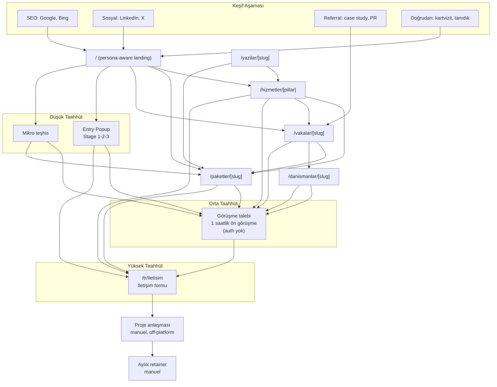
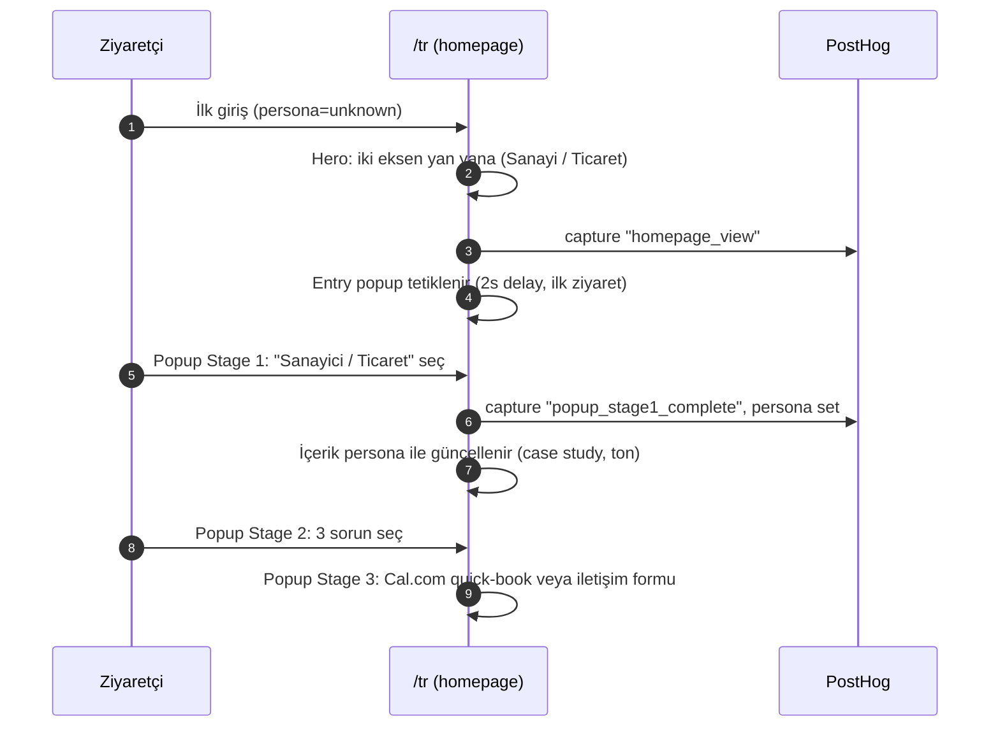
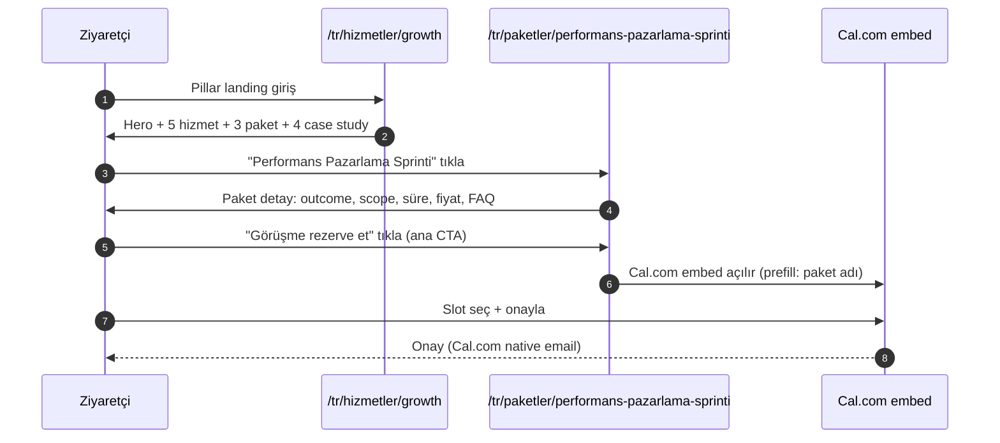
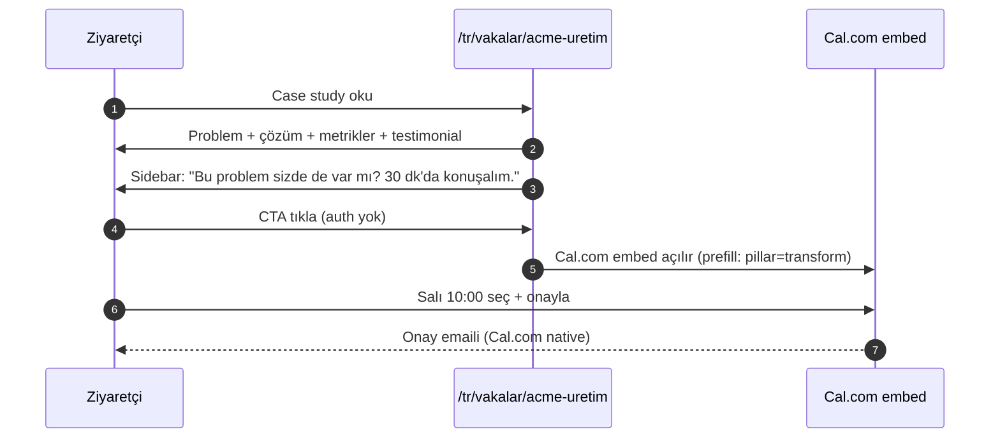
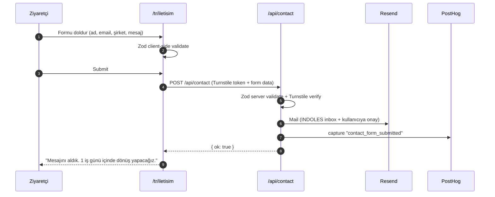

# 11 — Funnel ve Müşteri Akışları

> **Amaç:** Ziyaretçinin INDOLES sitesindeki dönüşüm yolculuklarını, üçlü taahhüt funnel'ını, AI agent devreye giriş noktalarını ve kritik karar anlarındaki UX davranışını sabitlemek.
>
> **Bağlı belgeler:** `01-vision-positioning.md`, `02-information-architecture.md`, `03-brand-voice-tone.md`, `07-ai-agent-spec.md`, `12-analytics-measurement.md`.

---

## 1. Üçlü Taahhüt Funnel'ı

INDOLES, farklı hazırlık seviyelerindeki potansiyel müşteriye üç farklı giriş kapısı sunar. Her biri farklı psikolojik ve zamansal yatırım ister; amaç her ziyaretçinin "kendi hızında" ilerlemesi.

| Taahhüt | Araç | Zaman | Giriş bariyeri | Amaç |
|---|---|---|---|---|
| **Düşük** | Entry popup + mikro teşhis araçları | 30 sn – 3 dk | Sıfır (auth yok) | İhtiyaç keşfi, INDOLES ile ilk temas, persona sinyalleri |
| **Orta** | Ücretsiz 1 saatlik ön görüşme (kendi takvim sistemi — ADR-025, entegrasyon bekliyor; geçişte iletişim formu) | 1 saat | Düşük (email + takvim, auth yok) | Somut problem tartışması, insan kanıtı, paket/proje önerisi |
| **Yüksek** | İletişim formu → detaylı brief (mail) | 10-15 dk form | Orta (şirket bilgisi, problem tanımı) | Satış niyeti netleşmiş müşteri, INDOLES takip eder |

**Temel prensip:** Ziyaretçi hangi kapıdan girerse girsin, **funnel bir sonraki adıma kendi hızında iter**. Agresif satış yok; ama her sayfa en az bir "bir sonraki adım" CTA'sı taşır.

---

## 2. Üç Giriş Kapısı Detay

### 2.1 Düşük taahhüt: Entry popup + mikro teşhis

**Araçlar:**
- **Entry popup** — ilk ziyarette homepage'de tetiklenir. 3 aşama: persona seçimi (Stage 1) → problem seçimi (Stage 2) → görüşme talebi veya iletişim formu (Stage 3; Cal.com kaldırıldı — ADR-025). Detay: `docs/superpowers/specs/2026-04-17-entry-popup-design.md`.
- **Mikro teşhis araçları** (launch'ta 1-2 adet, v2'de genişler):
  - "Dijital dönüşüm hazırlık skoru" — 10 soruluk quiz, skor + yorum + ilgili pillar/paket önerisi
  - "Büyüme fırsatı teşhisi" — 8 soruluk quiz, ticaret persona için
- **Hesaplayıcılar** (v2): ROI kalkülatörü, LTV/CAC hesabı
- **AI chatbot** — Faz 2; gerekçe ADR-007.

**Amaç:**
- Ziyaretçinin kendi sorununu sayılaştırması.
- INDOLES'in "düşünüyor" olduğunu göstermek (pasif broşür değil, aktif asistan).
- Persona + ilgi sinyali toplamak (PostHog person properties).

**Çıkış noktaları:**
- "1 saatlik ücretsiz görüşme al" CTA'sı (talep formu; takvim entegrasyonu bekleniyor — ADR-025).
- "İlgili paket" inline öneri.
- İletişim formu (yüksek taahhüde köprü).

### 2.2 Orta taahhüt: Ön görüşme (kendi takvim sistemi — ADR-025)

**Özellik:**
- 30 dakika, ücretsiz.
- Pillar'a göre uygun danışmanla eşleştirme; slot daveti e-postayla gider.
- Geçiş dönemi: iletişim formu + e-posta; takvim sistemi entegre olunca sayfa içi widget döner.

**Akış:**
1. CTA'ya tıkla → görüşme talep formu açılır (auth yok).
2. Form gönderilir; uygun slot birlikte belirlenir.
3. Takvim daveti e-postayla gönderilir.
4. Görüşme sonrası danışman notu → iletişim formu veya doğrudan e-posta (opsiyonel).

**Hedef metrik:** Ziyaret → ön görüşme dönüşümü %3-5 (industry benchmark %1-2'nin üstü).

### 2.3 Yüksek taahhüt: İletişim formu

**Özellik:**
- Detaylı iletişim formu: ad, soyad, e-posta, telefon, şirket, konu, mesaj. Auth gerektirmez.
- Submit → `/api/contact` → Resend ile INDOLES inbox'ına mail + PostHog event. INDOLES 1 iş günü içinde dönüş yapar.

**Akış:**
1. "İletişim kur" / "Brief gönder" CTA'sı (tüm pillar/paket sayfalarında secondary CTA).
2. `/tr/iletisim` sayfası — form doldur (auth yok).
3. Submit → `POST /api/contact` → mail + PostHog capture.
4. Success state: "Mesajını aldık. 1 iş günü içinde dönüş yapacağız."

**Hedef metrik:** Form submit edilenlerin %50+'si proje/retainer görüşmesine dönüşür.

---

## 3. Tam Funnel Diyagramı

---

## 4. Kritik Ekran Akışları

### 4.1 Anasayfa — persona keşfi + entry popup

**Çıkış noktaları:** Pillar detay, paket grid, case study grid, ön görüşme CTA, iletişim formu.

### 4.2 Pillar landing → paket seçimi → görüşme

> **Not:** Ödeme (Stripe/iyzico) launch'ta yok (ADR-009). Paketler görüşme sonrası teklifleşme ile satılır.

### 4.3 Case study → görüşme rezervasyonu

### 4.4 İletişim formu (yüksek taahhüt)

### 4.5 AI agent akışı — Faz 2

> **Not:** AI agent launch'ta kaldırıldı (ADR-007). Faz 2'de FAQ asistanı olarak geri gelebilir. Mevcut alternatifler: entry popup Stage 3 (booking veya iletişim formu) + mikro teşhis araçları.

---

## 5. Dashboard — Faz 2

> **Not:** Auth-gated kullanıcı dashboard'u (`/app/dashboard`, `/app/brief/[id]`, `/app/rezervasyon`) launch'ta yok (ADR-008). Bu rota'lar mevcut mimaride bulunmaz. Faz 2'de müşteri portalı somutlaşırsa bu bölüm güncellenir (CLAUDE.md §6'da müşteri portalı Faz 2 kararı).

---

## 6. Admin Akışları

### 6.1 Yeni iletişim formu / popup triage

1. Resend: "Yeni iletişim formu / popup submit" mail → INDOLES inbox.
2. PostHog dashboard: `contact_form_submitted` veya `popup_stage3_submitted` event'leri.
3. INDOLES 1 iş günü içinde e-posta veya telefon ile geri döner.

### 6.2 Case study yayınlama

1. Consultant `content/vakalar/{slug}.{tr,en}.mdx` veya `src/lib/content/cases.ts` üzerinde draft yazar (git branch).
2. Admin review: fotoğraf, metrik, dil tutarlılığı (PR review).
3. Admin merge → Vercel production deploy → sayfa build-time statik olarak üretilir.

### 6.3 Paket durum güncelleme

1. `src/lib/content/packages.ts` içinde paket `active: false` olarak güncellenir (git PR).
2. Paket sayfası 404 yerine "Şu an bu paket aktif değil" + benzer öneriler.

---

## 7. AI Agent Devreye Giriş Noktaları — Faz 2

> **Not:** AI chatbot launch'ta kaldırıldı (ADR-007). Aşağıdaki tablonun yerini şu an entry popup (Stage 1-2-3) ve mikro teşhis araçları almaktadır. Faz 2'de chatbot FAQ asistanı olarak geri gelirse bu bölüm yeniden aktive edilecek.

| Sayfa | Mevcut alternatif (launch) |
|---|---|
| Homepage | Entry popup (Stage 1-2-3) |
| Pillar landing | Persona CTA + Cal.com embed |
| Paket detay | "Görüşme rezerve et" CTA |
| Case study | "30 dk konuşalım" sidebar CTA |
| İletişim sayfası | Form |
| 404 sayfası | Ana sayfaya yönlendirme |

---

## 8. Dropoff ve Recovery

### 8.1 İletişim formu abandon
- Form dolduruldu ama submit olmadı → local storage draft (opsiyonel, Faz 2).

### 8.2 Rezervasyon abandon
- Cal.com embed açıldı ama slot seçilmedi → overlay "Uygun slot bulamadın mı? İletişim formuyla da ulaşabilirsin."

### 8.3 Checkout abandon — Faz 2

> Ödeme yok (ADR-009). Bu konu Faz 2'de online checkout eklenirse ele alınır.

### 8.4 Email re-engagement

Re-engagement Inngest job'ları olmadan mail üzerinden manuel olarak yürütülür. PostHog segment + manuel Resend broadcast (Faz 2 otomasyonu için).

---

## 9. Persona Değişimi ve Runtime Davranış

Persona sabit değil — ziyaretçi sitede gezerken değişir.

**Persona state machine:**
- Başlangıç: `unknown`
- Sinyaller birikir (her action weight'li)
- Eşik aşılınca `industrial` veya `commerce` state'ine geçer
- Ters yönde güçlü sinyal gelirse geri döner (ör. industrial user commerce case'lere gitmeye başlar)

**Etki alanları:**
- Hero hero copy + CTA wording
- Case study önerileri (homepage grid, sidebar)
- Chatbot ton
- Email template (transactional)

**Override:** Kullanıcı manuel tercih ederse (header toggle, chatbot) override kalıcı olur (cookie).

---

## 10. Metrikler ve KPI Tetikleyicileri

`12-analytics-measurement.md`'deki event'lere bağlı. Kritik funnel metrikleri:

| Metrik | Hedef (launch+6 ay) | Alarm |
|---|---|---|
| Homepage → pillar tıklama oranı | > %35 | < %20 |
| Pillar → paket tıklama oranı | > %25 | < %15 |
| Paket → "satın al" tıklama | > %12 | < %5 |
| Case study → booking CTA tıklama | > %8 | < %3 |
| Booking form complete rate | > %70 | < %50 |
| Brief form start → submit | > %55 | < %35 |
| Popup Stage 1 → Stage 2 geçiş oranı | > %60 | < %40 |
| Popup Stage 2 → Stage 3 geçiş oranı | > %50 | < %30 |
| Popup tamamlama (Stage 3 action) | > %25 | < %15 |

---

## 11. Açık Sorular

| # | Soru | Önerilen v1 cevabı | Ne zaman |
|---|---|---|---|
| 1 | Paket ödemesi doğrudan brief olmadan mı? | Evet — bazı paketler self-serve | Paket bazında karar |
| 2 | Booking ücretsiz, paket ücretli, brief ücretsiz — bu paylaşım net mi? | Evet (launch için) | — |
| 3 | Stripe checkout'ta kurumsal e-fatura ihtiyacı? | iyzico TR için e-fatura auto; Stripe'da manual invoice (v2) | İlk TR ödemede netleş |
| 4 | Booking no-show policy — ücret mi, re-schedule mi? | Ücretsiz booking'de policy yok; ücretli'de 24h iptal | — |
| 5 | Brief attach edilen dosyaların admin görünürlüğü | Admin + atanan consultant | — |
| 6 | Diagnostic tool skoru kaydedilsin mi? | Evet, anonim → user'a bağlan login'de | v1 |
