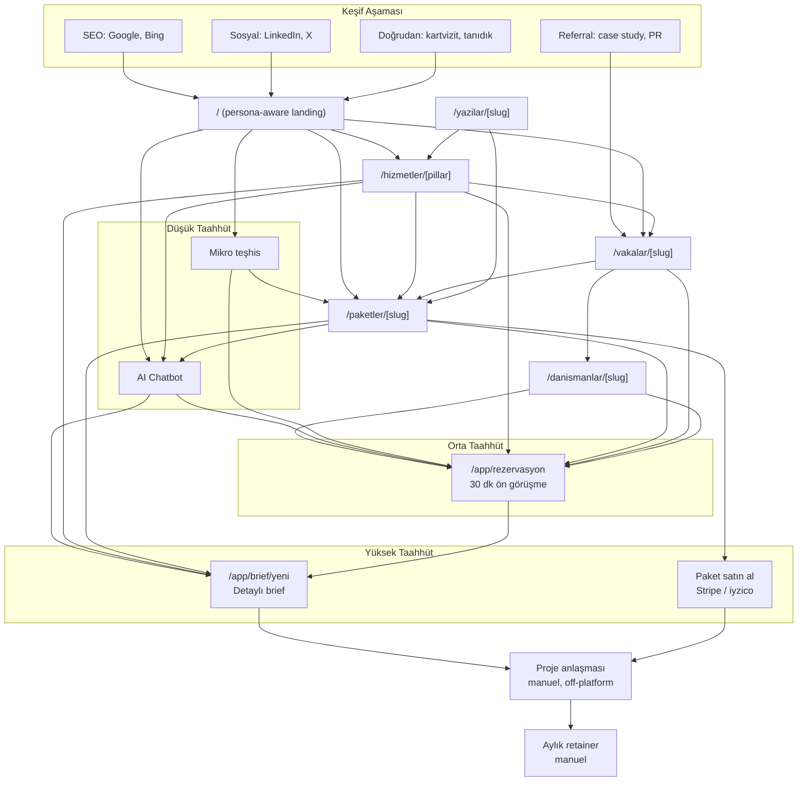
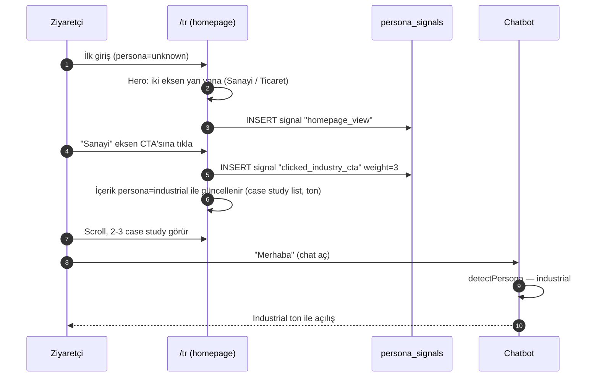
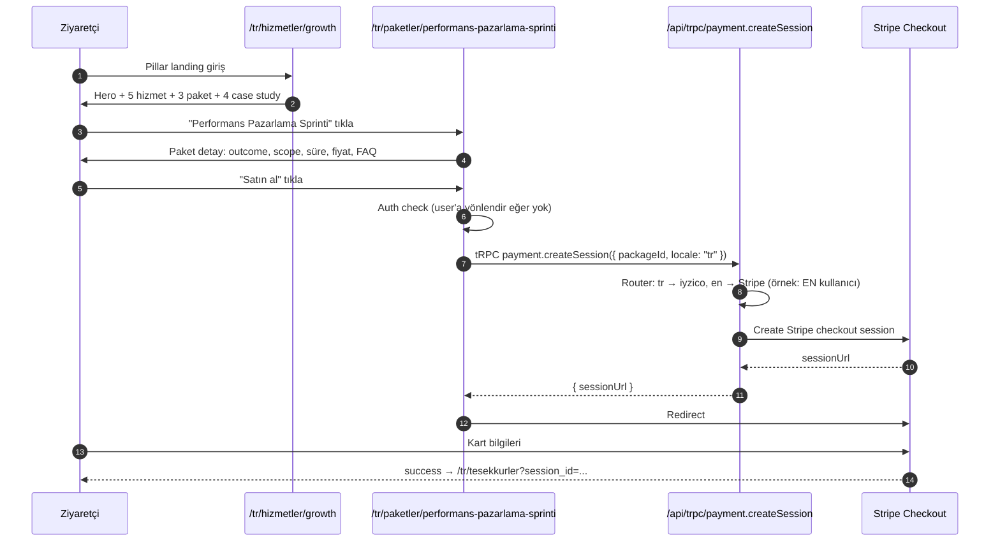
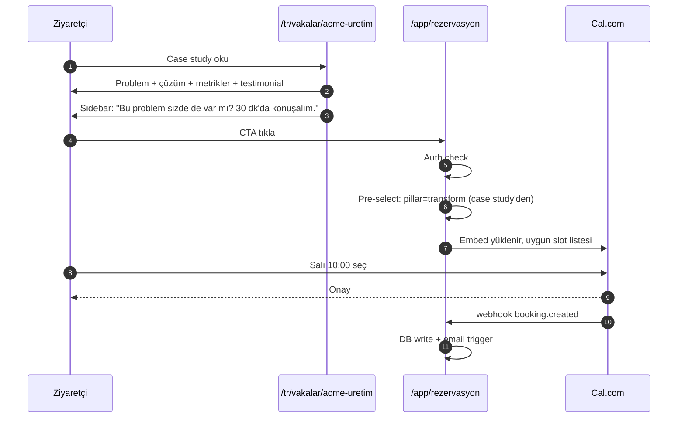
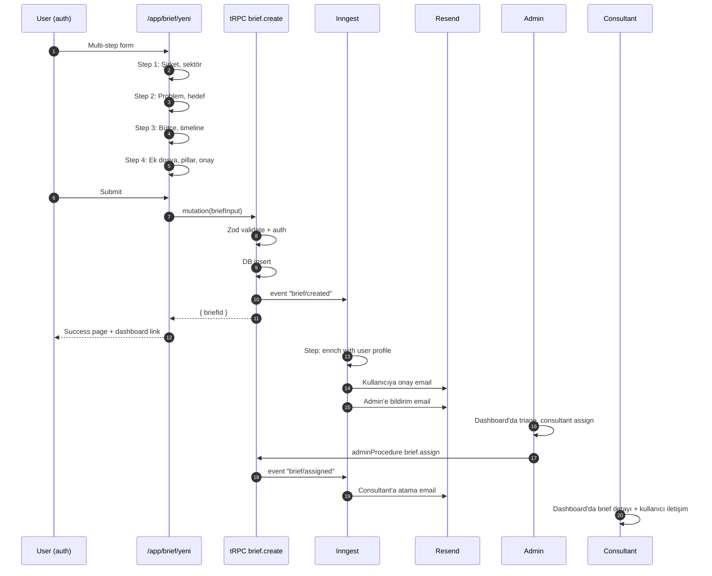
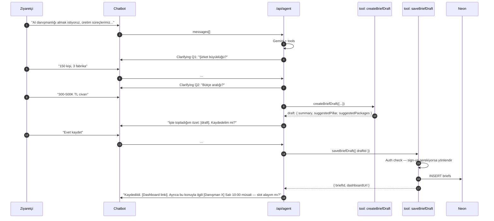

# 11 — Funnel ve Müşteri Akışları

> **Amaç:** Ziyaretçinin INDOLES sitesindeki dönüşüm yolculuklarını, üçlü taahhüt funnel'ını, AI agent devreye giriş noktalarını ve kritik karar anlarındaki UX davranışını sabitlemek.
>
> **Bağlı belgeler:** `01-vision-positioning.md`, `02-information-architecture.md`, `03-brand-voice-tone.md`, `07-ai-agent-spec.md`, `12-analytics-measurement.md`.

---

## 1. Üçlü Taahhüt Funnel'ı

INDOLES, farklı hazırlık seviyelerindeki potansiyel müşteriye üç farklı giriş kapısı sunar. Her biri farklı psikolojik ve zamansal yatırım ister; amaç her ziyaretçinin "kendi hızında" ilerlemesi.

| Taahhüt | Araç | Zaman | Giriş bariyeri | Amaç |
|---|---|---|---|---|
| **Düşük** | İnteraktif teşhis / AI agent / mikro araçlar | 30 sn – 3 dk | Sıfır (auth yok) | İhtiyaç keşfi, INDOLES ile ilk temas, persona sinyalleri |
| **Orta** | Ücretsiz 30 dk ön görüşme (Cal.com) | 30 dk + auth | Düşük-orta (email + takvim) | Somut problem tartışması, insan kanıtı, paket/proje önerisi |
| **Yüksek** | Detaylı brief → proje veya aylık retainer | 15-30 dk form + auth | Yüksek (şirket bilgisi, problem tanımı, ekler) | Satış niyeti netleşmiş müşteri, triage + atama |

**Temel prensip:** Ziyaretçi hangi kapıdan girerse girsin, **funnel bir sonraki adıma kendi hızında iter**. Agresif satış yok; ama her sayfa en az bir "bir sonraki adım" CTA'sı taşır.

---

## 2. Üç Giriş Kapısı Detay

### 2.1 Düşük taahhüt: İnteraktif araçlar + AI agent

**Araçlar:**
- **AI chatbot** — her sayfada sağ alt köşede (bkz. `07-ai-agent-spec.md`). Soru sor, teşhis al, paket/case öner.
- **Mikro teşhis araçları** (launch'ta 1-2 adet, v2'de genişler):
  - "Dijital dönüşüm hazırlık skoru" — 10 soruluk quiz, skor + yorum + ilgili pillar/paket önerisi
  - "Büyüme fırsatı teşhisi" — 8 soruluk quiz, ticaret persona için
- **Hesaplayıcılar** (v2): ROI kalkülatörü, LTV/CAC hesabı

**Amaç:**
- Ziyaretçinin kendi sorununu sayılaştırması.
- INDOLES'in "düşünüyor" olduğunu göstermek (pasif broşür değil, aktif asistan).
- Persona + ilgi sinyali toplamak (`persona_signals` tablosu).

**Çıkış noktaları:**
- "30 dakikalık ücretsiz görüşme al" CTA'sı.
- "İlgili paket" inline öneri.
- "Daha detaylı teşhis için brief yaz" (yüksek taahhüde köprü).

### 2.2 Orta taahhüt: Ön görüşme (Cal.com)

**Özellik:**
- 30 dakika, ücretsiz.
- Pillar'a göre uygun danışman otomatik atanır (Cal.com round-robin + consultant.pillar_focus).
- Embed veya `/app/rezervasyon` sayfasında.

**Akış:**
1. CTA'ya tıkla → auth gerekli (yoksa sign-up → email verify).
2. Cal.com embed'de slot seç.
3. Onay → Neon'da `bookings` row + Inngest event.
4. Resend ile onay emaili (TR/EN).
5. 24h + 1h önce hatırlatma (Inngest).
6. Görüşme sonrası danışman notu → brief draft (opsiyonel).

**Hedef metrik:** Ziyaret → ön görüşme dönüşümü %3-5 (industry benchmark %1-2'nin üstü).

### 2.3 Yüksek taahhüt: Brief

**Özellik:**
- Detaylı form: şirket, sektör, problem (50-5000 char), bütçe (3 kademe), timeline, pillar tercihi, ek dosya.
- Auth zorunlu.
- Brief gönderildi → Inngest triage → admin'e bildirim → 1 iş günü içinde danışman ataması + slot önerisi email.

**Akış:**
1. "Brief gönder" CTA'sı (tüm pillar/paket sayfalarında secondary CTA).
2. Auth → `/app/brief/yeni`.
3. Multi-step form (4 step):
   - Şirket ve sektör
   - Problem tanımı + hedef
   - Bütçe ve timeline
   - Ek + pillar tercihi + onay
4. Submit → tRPC `brief.create` → Neon INSERT → Inngest `brief/created`.
5. Success page: "Brief alındı. 1 iş günü içinde dönüş."
6. Dashboard'dan takip: draft, pending, triaged, in_discussion, converted.

**Hedef metrik:** Brief submit edilenlerin %50+'si proje/retainer'a dönüşür.

---

## 3. Tam Funnel Diyagramı

---

## 4. Kritik Ekran Akışları

### 4.1 Anasayfa — persona keşfi

**Çıkış noktaları:** Pillar detay, paket grid, case study grid, chat, ön görüşme CTA.

### 4.2 Pillar landing → paket seçimi → ödeme

### 4.3 Case study → görüşme rezervasyonu

### 4.4 Brief submit (yüksek taahhüt)

### 4.5 AI agent → brief draft → save

---

## 5. Dashboard — Auth'lu Kullanıcı Deneyimi

### 5.1 `/app/dashboard` yapısı

Ziyaretçi kullanıcı giriş yaptıktan sonra ana alanı:

| Widget | İçerik |
|---|---|
| **Next step** | En kritik aksiyon: pending brief varsa "triaj bekleniyor"; booking varsa "X gün kaldı"; yeni kullanıcıysa "Brief gönder" |
| **Brieflerim** | Status + ilerleme + last activity |
| **Rezervasyonlarım** | Upcoming + past booking'ler, Cal.com join link |
| **Ödeme geçmişi** | Paket satın alımları, faturalar (v2) |
| **Önerilen içerik** | Persona + brief pillar'ına göre 3-5 case study / yazı |
| **Chatbot** | Eski sohbet geçmişi + "sor" |

### 5.2 `/app/brief/[id]` — brief detayı

- Brief içeriği (read-only)
- Statü timeline (pending → triaged → in_discussion → converted)
- Atanmış danışman profili
- Cal.com embed (varsa uygun slot'lar)
- Mesaj thread'i (v2, şu an email)

### 5.3 `/app/rezervasyon` — yeni rezervasyon

- Cal.com embed
- Pillar/danışman filtresi
- Post-booking: success state + dashboard

---

## 6. Admin Akışları

### 6.1 Yeni brief triage

1. Email: "Yeni brief geldi — [kullanıcı]"
2. Admin `/admin/briefs` → liste.
3. Brief aç → content inceleme.
4. Durum: "Triage bitti" → assignConsultant → status `triaged`.
5. Consultant'a atanma emaili (Inngest).
6. Kullanıcıya "danışmanınız atandı" emaili + suggested slot'lar.

### 6.2 Case study yayınlama

1. Consultant `content/vakalar/{slug}.{tr,en}.mdx` veya `src/lib/content/cases.ts` üzerinde draft yazar (git branch).
2. Admin review: fotoğraf, metrik, dil tutarlılığı (PR review).
3. Admin merge → production deploy → sayfa build-time statik olarak üretilir.

### 6.3 Paket durum güncelleme

1. `src/lib/content/packages.ts` içinde paket `active: false` olarak güncellenir (git PR) veya Neon `packages.active = false` admin panelden set edilir.
2. Paket sayfası 404 yerine "Şu an bu paket aktif değil" + benzer öneriler.

---

## 7. AI Agent Devreye Giriş Noktaları

| Sayfa | Chatbot davranışı |
|---|---|
| Homepage | Pasif (bubble), tıklandıktan sonra persona-agnostic açılış |
| Pillar landing | Persona auto-set (URL'den), "Bu pillar'da hangi konuyla gelmek istersiniz?" |
| Paket detay | Paket context'i agent'a inject: "Bu paketin X özelliği için sorular..." |
| Case study | Case study context: "Bu vakayı okurken soru oluştu mu?" |
| Brief formu (tereddüt eden user) | 30 sn inaktivite → hafif nudge: "Brief yazarken yardım edebilirim" |
| Dashboard | Kullanıcı context + history: "Son brief'in için uygun slot'lar var. Gösterebilir miyim?" |
| 404 sayfası | "Aradığın şeyi bulamadım. Ne arıyordun? Belki yardım edebilirim." |

---

## 8. Dropoff ve Recovery

### 8.1 Brief formu abandon
- Form 15+ sn idle + boş submit → autosave draft (local storage).
- Kullanıcı geri döndüğünde: "Kaldığın yerden devam et?" modal.
- Submit olmadan çıkarsa: hafif toast "Draft kaydedildi, dashboard'dan geri dönebilirsin."

### 8.2 Rezervasyon abandon
- Cal.com embed açıldı ama slot seçilmedi → 30 sn sonra overlay "Uygun slot bulamadın mı? Danışman seçimi değiştir veya Sana bir seçim önerelim [AI agent]."

### 8.3 Checkout abandon
- Stripe/iyzico redirect döndü ama success yok → `/checkout/retry` — "Ödeme tamamlanmadı. Tekrar dene veya destek iste."

### 8.4 Email re-engagement
- Brief pending 3 gün → hatırlatma email.
- Rezervasyon no-show → "Tekrar planlamak ister misin?" email + 1 tık reschedule link.
- Chat başlatıldı → sohbet kalmış: 7 gün sonra "Kaldığın yerden devam et?" email.

---

## 9. Persona Değişimi ve Runtime Davranış

Persona sabit değil — ziyaretçi sitede gezerken değişir.

**Persona state machine:**
- Başlangıç: `unknown`
- Sinyaller birikir (her action weight'li)
- Eşik aşılınca `industrial` veya `commerce` state'ine geçer
- Ters yönde güçlü sinyal gelirse geri döner (ör. industrial user commerce case'lere gitmeye başlar)

**Etki alanları:**
- Hero hero copy + CTA wording
- Case study önerileri (homepage grid, sidebar)
- Chatbot ton
- Email template (transactional)

**Override:** Kullanıcı manuel tercih ederse (header toggle, chatbot) override kalıcı olur (cookie).

---

## 10. Metrikler ve KPI Tetikleyicileri

`12-analytics-measurement.md`'deki event'lere bağlı. Kritik funnel metrikleri:

| Metrik | Hedef (launch+6 ay) | Alarm |
|---|---|---|
| Homepage → pillar tıklama oranı | > %35 | < %20 |
| Pillar → paket tıklama oranı | > %25 | < %15 |
| Paket → "satın al" tıklama | > %12 | < %5 |
| Case study → booking CTA tıklama | > %8 | < %3 |
| Booking form complete rate | > %70 | < %50 |
| Brief form start → submit | > %55 | < %35 |
| Chatbot başlangıç → useful action (link click, CTA) | > %40 | < %20 |
| Chatbot → booking conversion | > %20 | < %10 |
| Chatbot → brief conversion | > %10 | < %5 |

---

## 11. Açık Sorular

| # | Soru | Önerilen v1 cevabı | Ne zaman |
|---|---|---|---|
| 1 | Paket ödemesi doğrudan brief olmadan mı? | Evet — bazı paketler self-serve | Paket bazında karar |
| 2 | Booking ücretsiz, paket ücretli, brief ücretsiz — bu paylaşım net mi? | Evet (launch için) | — |
| 3 | Stripe checkout'ta kurumsal e-fatura ihtiyacı? | iyzico TR için e-fatura auto; Stripe'da manual invoice (v2) | İlk TR ödemede netleş |
| 4 | Booking no-show policy — ücret mi, re-schedule mi? | Ücretsiz booking'de policy yok; ücretli'de 24h iptal | — |
| 5 | Brief attach edilen dosyaların admin görünürlüğü | Admin + atanan consultant | — |
| 6 | Diagnostic tool skoru kaydedilsin mi? | Evet, anonim → user'a bağlan login'de | v1 |
