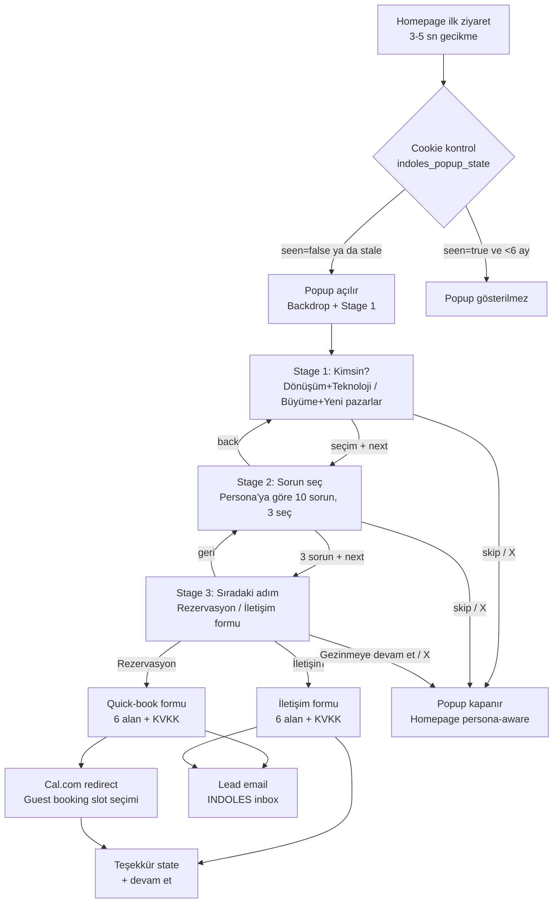
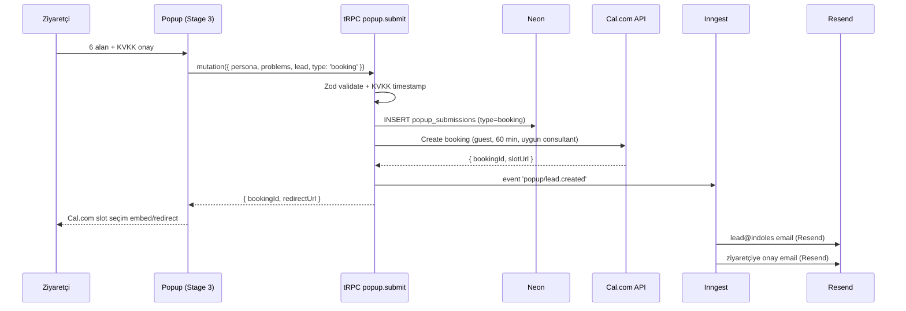

# Entry Popup — Tasarım Spec

> **Tarih:** 2026-04-17
> **Durum:** Taslak — review bekliyor
> **Karar sahibi:** Burak Arda Özgül
> **Bağlı belgeler:** `docs/01-vision-positioning.md`, `docs/02-information-architecture.md`, `docs/03-brand-voice-tone.md`, `docs/06-data-model.md`, `docs/11-funnel-customer-flows.md`, `docs/12-analytics-measurement.md`

> **Altkatman revize (2026-04-17):** Bu spec davranışsal olarak geçerlidir. Altkatman (tRPC → REST, DB → mail+PostHog, Cal.com API → embed prefill, chatbot injection düşer, 24 ay retention/duplicate check düşer) `docs/decisions/ADR-013-popup-rest-migration.md` ile yürürlüğe girmiştir. Değişen bölümler: §6.3, §8, §9, §10, §11.3, §15.2.

---

## 1. Amaç ve Scope

### 1.1 Problem

INDOLES'in anasayfası ziyaretçinin "kim" olduğunu (Sanayici / Ticaret) ve "ne aradığını" (Dönüşüm / Büyüme) iki farklı eksende yakalamayı hedefliyor. Mevcut plan (docs/11) iki mikro quiz + homepage hero switch üzerinden bu veriyi dolaylı topluyor. Sonuç: persona verisi dağınık, dolduran sayısı düşük, chatbot ve içerik personalization'ı için güvenilir sinyal yetersiz.

### 1.2 Çözüm

Homepage'de, ilk ziyarette tetiklenen üç aşamalı bir giriş popup'ı. Stage 1 ziyaretçinin kimliğini + ihtiyacını birleşik tek seçimde yakalar. Stage 2 persona'ya özel 10 durum-temelli sorun üzerinden üç tanesini seçtirir. Stage 3 ziyaretçiyi iki angaje-olma yoluna (1 saatlik quick-book rezervasyon veya iletişim formu) yönlendirir; isteyen "gezinmeye devam et" ile çıkabilir.

### 1.3 Hedefler

- Ziyaretçilerin **%25+**'sı popup'ı tamamlasın (Stage 3'e ulaşsın veya en az Stage 2'yi geçsin).
- Homepage → rezervasyon conversion'ı %3-5'ten **%5-8**'e çıksın (popup quick-book + lead email ile).
- `persona_signals` doğruluğu: popup tamamlayan ziyaretçilerde persona **>%90 güvenli** şekilde set edilsin.
- Chatbot, popup sonrası ziyaretçinin seçimini bilerek açılış yapsın.

### 1.4 Out of Scope

| Kapsam dışı | Sebep |
|---|---|
| Popup'ı her sayfada göstermek | SEO penalty riski, mobile bounce; homepage-only yeterli |
| Campaign mode / time-limited | Kalıcı altyapı hedefleniyor |
| Popup içinde detaylı brief akışı | Brief `/app/brief/yeni` sayfasında kalır; popup sadece angajman başlangıcı |
| A/B testing altyapısı | Launch sonrası ayrı iş; PostHog feature flag ile sonra eklenir |
| Yeniden soru sorma dinamiği (Stage 2 içinde follow-up) | İleri faz; launch'ta sabit 10 sorun yeterli |

---

## 2. Üç Aşamalı Akış

### 2.1 Akış diyagramı



### 2.2 Her aşamanın çıkışları

| Aşama | İleri | Geri | Skip | Kapat (×) |
|---|---|---|---|---|
| Stage 1 | → Stage 2 | — | — | Popup kapanır, persona=unknown |
| Stage 2 | → Stage 3 (3 seçim zorunlu) | ← Stage 1 | — | Popup kapanır, Stage 1 verisi saklanır |
| Stage 3 | Rezervasyon / İletişim | ← Stage 2 | "Gezinmeye devam et" linki | Popup kapanır, Stage 1-2 verisi saklanır |

---

## 3. Tetikleme ve Persistence

### 3.1 Tetikleyici

- **Sayfa:** Yalnızca `/tr` ve `/en` (homepage root). Hizmet, paket, vaka, yazı sayfalarında popup **açılmaz**.
- **Zaman:** Sayfa interactive olduktan **4 saniye** sonra.
- **Koşul:** `indoles_popup_state` cookie'si uygunsa.

### 3.2 Cookie yapısı

**Cookie adı:** `indoles_popup_state`
**Scope:** `.indoles.com.tr`, `Secure`, `SameSite=Lax`, `HttpOnly=false` (client'tan okuyabilmek için).
**Süre:** 6 ay (persona stale olmasın diye), skip halinde 30 gün.

```json
{
  "version": 1,
  "lastShownAt": "2026-04-17T10:00:00Z",
  "outcome": "completed | skipped | dismissed",
  "persona": "donusum-teknoloji | buyume-pazarlar | null",
  "problems": ["problem-1-slug", "problem-2-slug", "problem-3-slug"],
  "expiresAt": "2026-10-17T10:00:00Z"
}
```

### 3.3 Tetikleme kuralları

| Durum | Davranış |
|---|---|
| Cookie yok | Göster |
| `outcome=dismissed` ve `expiresAt > now` (30 gün içinde) | Gösterme |
| `outcome=dismissed` ve `expiresAt < now` (30 gün sonra) | Yeniden göster |
| `outcome=skipped` ve `expiresAt < now` (30 gün sonra) | Yeniden göster |
| `outcome=completed` ve `expiresAt > now` (6 ay içinde) | Gösterme |
| `outcome=completed` ve `expiresAt < now` (6 ay sonra) | Yeniden göster ("Durum güncellemesi ister misin?" hint'i ile) |

---

## 4. Stage 1 — Kimsin?

### 4.1 Amaç

Ziyaretçinin alıcı profilini + ihtiyaç tipini tek seçimde belirle.

### 4.2 Layout

Centered modal, ~520px width. Backdrop: `rgba(0,0,0,0.5)`, backdrop-blur 8px. Üstte progress indicator (dot pattern "● ○ ○") + "1 / 3".

İki büyük seçim kartı yan yana (mobile'da alt alta):

| Kart A | Kart B |
|---|---|
| **Dönüşüm ve Teknoloji** | **Büyüme ve Yeni Pazarlar** |
| Sanayi, üretim veya kurumsal operasyonda verimi artırmak, süreçleri otomatize etmek, AI ile dönüşmek istiyorum. | Ticaret, e-ticaret veya perakendede satış hacmini büyütmek, yeni pazarlara açılmak, markayı güçlendirmek istiyorum. |

Kart altında küçük yardım metni: "Hangisi sana daha yakın? Sonra değiştirebilirsin."

### 4.3 Persona mapping

| Seçim | Persona (docs/01) | Pillar eğilimi | Ton (docs/03) |
|---|---|---|---|
| Dönüşüm ve Teknoloji | `sanayici` | Transform + Build | Dingin, kurumsal, metodik |
| Büyüme ve Yeni Pazarlar | `ticaret` | Growth | Dinamik, atletik, sonuç-odaklı |

### 4.4 Event (PostHog)

`popup_stage1_selected` — payload: `{ persona, timeToSelect_ms }`

---

## 5. Stage 2 — Sorun seç

### 5.1 Amaç

Ziyaretçinin üç sıklıkla yaşadığı durumu öğren; sorunları pillar/service mapping ile routing'e bağla.

### 5.2 Yapı

- Stage 1 seçimine göre **10 sorun** dinamik olarak render edilir.
- Her sorun: kısa durum-temelli cümle (ilk tekil).
- Kullanıcı **tam olarak 3** seçmelidir. 3 seçilene kadar "Devam et" butonu disabled. 4'üncüye tıklarsa ilk seçim drop edilir (FIFO) ve toast: "3 sorun seçebilirsin."
- Mobile'da scroll, desktop'ta grid (2 kolon).

### 5.3 Sorun şablonu

Her sorun arka planda şu metadata'yı taşır:

```yaml
- slug: reklam-maliyeti-artisi
  persona: buyume-pazarlar
  text:
    tr: "Reklam maliyetim artıyor, ROAS düşüyor."
    en: "Ad costs are rising, ROAS is dropping."
  services: [performance-marketing, cro]
  pillar: growth
  weight: 1.0  # routing'de kullanılır
```

### 5.4 10 sorun — taslak (copy ayrı skill ile finalize edilir)

**Dönüşüm ve Teknoloji (sanayici persona):**

| # | Durum-temelli cümle (taslak) | Pillar | İlgili service'ler |
|---|---|---|---|
| 1 | Manuel süreçler ekibimi yavaşlatıyor. | Transform | İş Otomasyonları |
| 2 | Verimsizlik nerede, kesin bilemiyorum. | Transform | İşletme Mühendisliği, İş Zekası |
| 3 | AI'ın şirketime nasıl uygulanacağını göremiyorum. | Transform | AI Danışmanlığı |
| 4 | Verim ölçümüm var ama karar verdirmiyor. | Transform | İş Zekası |
| 5 | Operasyonu dijitale taşımak birkaç yıldır rafta. | Transform | Dijital Dönüşüm |
| 6 | Legacy sistem yeni iş modellerimi engelliyor. | Build | Özel Yazılım, Teknoloji Altyapısı |
| 7 | Mevcut ekip teknolojiyi takip edemiyor. | Transform | AI Danışmanlığı, Dijital Dönüşüm |
| 8 | İhracat veya yeni pazar için hazırlık eksik. | Transform + Growth | İşletme Mühendisliği, Marka Stratejisi |
| 9 | Tedarik ve üretim arasındaki veri kopuk. | Transform + Build | İş Zekası, Özel Yazılım |
| 10 | Önceliklendirme yapamıyorum, her şey acil. | Transform | İşletme Mühendisliği, Dijital Dönüşüm |

**Büyüme ve Yeni Pazarlar (ticaret persona):**

| # | Durum-temelli cümle (taslak) | Pillar | İlgili service'ler |
|---|---|---|---|
| 1 | Reklam maliyetim artıyor, ROAS düşüyor. | Growth | Performans Pazarlama, CRO |
| 2 | Siteye trafik var, satışa dönmüyor. | Growth | CRO, UI/UX Tasarım |
| 3 | Sipariş hacmim platoda, büyümüyor. | Growth | Performans Pazarlama, Marka Stratejisi |
| 4 | Yeni bir pazara/kanala girmek istiyorum. | Growth | Marka Stratejisi, E-Ticaret |
| 5 | Marka bilinirliğim yetersiz. | Growth | Marka Stratejisi |
| 6 | Müşteri kaybı (churn) yüksek. | Growth + Transform | CRO, İş Zekası |
| 7 | CAC artıyor, LTV düşüyor. | Growth | Performans Pazarlama, İş Zekası |
| 8 | Pazarlama kanallarını doğru yönetemiyorum. | Growth | Marka Stratejisi, Performans Pazarlama |
| 9 | E-ticaret altyapım satış yüküne dayanmıyor. | Growth + Build | E-Ticaret, Teknoloji Altyapısı |
| 10 | Rekabette geride kaldığımı hissediyorum. | Growth | Marka Stratejisi, CRO |

> Not: Copy taslağı. `indoles-brand-voice` skill'i ile final edilecek.

### 5.5 Event

`popup_stage2_submitted` — payload: `{ persona, problems: [slug, slug, slug], timeOnStage_ms }`

---

## 6. Stage 3 — Sıradaki adım

### 6.1 Amaç

Persona + sorun bilgisi alındı. Ziyaretçiyi angajmana iki yoldan birine yönlendir; istemiyorsa saygılı çıkış ver.

### 6.2 Layout

Ortada kısa özet: "Seçimini kaydettik. Şimdi nasıl devam edelim?"

Altında iki CTA kartı (primary + secondary):

| Primary | Secondary |
|---|---|
| **1 saatlik ücretsiz görüşme rezerve et** | **Bize anlatın, biz arayalım** |
| 6 alanı doldur → Cal.com'da slot seç. | 6 alanı doldur → 1 iş günü içinde dönüş. |

Altta tertiary link: `Şimdilik gezinmeye devam et →` (underline, gri).

Sağ üst `×` her zaman aktif.

### 6.3 Quick-book form (Rezervasyon)

6 alan, tek ekran, inline validation:

| Alan | Tip | Validation | Opsiyonel? |
|---|---|---|---|
| Ad | text | min 2 char | Hayır |
| Soyad | text | min 2 char | Hayır |
| Telefon | tel | TR + country code detect | Hayır |
| Email | email | RFC5322 | Hayır |
| Şirket | text | min 2 char | Hayır |
| Unvan | text | min 2 char | Hayır |

Altta **KVKK aydınlatma onayı** checkbox (zorunlu):

> Kişisel verilerimin KVKK kapsamında işlenmesini kabul ediyorum. [Aydınlatma metni](/tr/gizlilik)

Submit → `tRPC popup.submit` mutation → Cal.com API'ye guest booking create → Cal.com redirect URL → ziyaretçi Cal.com embed veya yeni tab'da slot seçer. Paralel olarak lead email tetiklenir.

### 6.4 İletişim formu (Contact)

Aynı 6 alan, aynı KVKK. Mesaj alanı **yok**. Submit → `tRPC popup.submit` → lead email + teşekkür state:

> "Teşekkürler. 1 iş günü içinde ulaşacağız. [Homepage'e dön]"

### 6.5 Event'ler

- `popup_stage3_viewed` — `{ persona, problems }`
- `popup_booking_submitted` — `{ persona, problems, leadId }`
- `popup_contact_submitted` — `{ persona, problems, leadId }`
- `popup_dismissed_stage3` — `{ persona, problems }` (× veya "gezinmeye devam et")

---

## 7. Homepage Hero Entegrasyonu

### 7.1 Değişiklik

Docs/11 ve CLAUDE.md'deki "iki eksen yan yana" hero switch **kalkar**. Yerine:

- **Popup seçimi varsa** (cookie'de `persona` set): Hero tek versiyon render edilir (seçili persona'ya göre).
- **Popup seçimi yoksa** (persona=null veya skip/dismiss sonrası): Hero **nötr default versiyon** gösterir — iki eksen vaadi eşit vurgulu, copy persona-agnostic.

### 7.2 Chip pattern

Hero'nun üst-sağında küçük bir persona indicator chip:

```
[ · Büyüme odaklı  ↓  değiştir ]
```

Tıklanınca popup tekrar açılır (Stage 1'den), kullanıcı seçimini değiştirebilir.

### 7.3 Etki alanı

Popup persona'ya göre şu öğeler homepage'de değişir:

| Öğe | Persona-aware davranış |
|---|---|
| Hero headline + copy | Persona'ya özel (sanayici dingin / ticaret dinamik) |
| Pillar highlight | Persona pillar'ı ilk sırada (Transform+Build / Growth) |
| Vaka grid (3 öne çıkan) | Persona pillar'ına uygun vakalar filtrelenir |
| Case study filter default | Persona pillar'ı pre-selected |
| Chatbot greeting | Persona-aware açılış |

### 7.4 Docs güncellemeleri

- `docs/02-information-architecture.md` — hero yapısı güncellenir.
- `docs/03-brand-voice-tone.md` — default nötr hero için copy örnekleri eklenir.

---

## 8. Chatbot Entegrasyonu

### 8.1 Context injection

Popup tamamlandığında `persona_signals` tablosuna entry yazılır + cookie'ye persona+problems set edilir. Chatbot mount olduğunda bu veriyi okur.

**Chatbot system prompt'una inject edilen blok:**

```
Ziyaretçi persona: {persona_label_tr}
Son 3 seçilmiş sorun:
- {problem_1_text}
- {problem_2_text}
- {problem_3_text}

Bu bilgileri ilk mesajında DOĞRUDAN alıntılama.
Ama soruları bunlara göre yorumla ve öneri yap.
```

### 8.2 Davranış kuralları

- İlk mesaj persona tonuna uygun olur (sanayici → dingin, ticaret → dinamik).
- Ziyaretçi "ben ne sorun yaşıyorum?" derse chatbot 3 sorunu hatırlatabilir.
- Paket/vaka önerisi sorun mapping'ine göre önceliklendirilir.

### 8.3 Docs güncellemesi

`docs/07-ai-agent-spec.md` — context injection bölümü genişletilir, persona+problems nasıl okuyacağı eklenir.

---

## 9. Data Model

### 9.1 `persona_signals` (mevcut, genişletilir)

Mevcut tablo `docs/06-data-model.md`'de var. Yeni signal tipi:

```sql
-- signal_type yeni değerler:
-- 'popup_persona_selected'  (weight: 10, yüksek otorite)
-- 'popup_problem_selected'  (weight: 3 per problem)
```

### 9.2 Yeni tablo: `popup_submissions`

```sql
CREATE TABLE popup_submissions (
  id UUID PRIMARY KEY DEFAULT gen_random_uuid(),
  created_at TIMESTAMPTZ NOT NULL DEFAULT now(),
  session_id TEXT NOT NULL,           -- anonim session track için
  user_id UUID REFERENCES users(id),  -- login sonrası bağlanabilir, nullable
  persona TEXT NOT NULL,               -- 'donusum-teknoloji' | 'buyume-pazarlar'
  problems TEXT[] NOT NULL,            -- selected problem slug'ları (3 eleman)
  -- Lead info (Stage 3 form submit olduysa)
  first_name TEXT,
  last_name TEXT,
  phone TEXT,
  email TEXT,
  company TEXT,
  title TEXT,
  submission_type TEXT NOT NULL,       -- 'booking' | 'contact' | 'dismissed' | 'skipped'
  kvkk_consent_at TIMESTAMPTZ,         -- consent timestamp (KVKK audit için)
  locale TEXT NOT NULL,                -- 'tr' | 'en'
  -- Integration IDs
  cal_com_booking_id TEXT,             -- Cal.com booking ID (booking path)
  email_sent_at TIMESTAMPTZ,           -- lead email gönderildi mi
  -- Meta
  user_agent TEXT,
  referrer TEXT,
  utm_source TEXT,
  utm_medium TEXT,
  utm_campaign TEXT
);

CREATE INDEX idx_popup_submissions_email ON popup_submissions(email);
CREATE INDEX idx_popup_submissions_persona ON popup_submissions(persona);
CREATE INDEX idx_popup_submissions_created ON popup_submissions(created_at DESC);
```

### 9.3 Problem taxonomy — kod veya Sanity?

**Karar:** Launch'ta **kod içinde** (`src/lib/popup/problems.ts`). Sebep: 20 adet sabit içerik, i18n kolay, review'dan geçmiş brand voice. Sanity'ye taşımak ileri fazda (content team ölçeğinde).

### 9.4 Docs güncellemesi

`docs/06-data-model.md` — yeni `popup_submissions` tablosu + ER diyagrama ekle.

---

## 10. Cal.com Entegrasyonu (Quick-book)

### 10.1 Akış

Auth gerektirmeyen quick-book akışı. Docs/11'deki auth-required flow **korunur** (`/app/rezervasyon` için). Popup ayrı path kullanır.



### 10.2 Cal.com API kullanımı

- **Endpoint:** Cal.com Managed Bookings API (v2)
- **Event type:** `indoles-1saat-gorusme` (yeni event type, Cal.com'da oluşturulur)
- **Round-robin:** Persona'ya uygun danışman set'i arasından
  - Sanayici → Transform + Build pillar consultants
  - Ticaret → Growth pillar consultants
- **Guest booking:** Email + name ile, Clerk account oluşturmadan

### 10.3 Docs güncellemesi

`docs/11-funnel-customer-flows.md` — quick-book flow ekle; 30 dk vs 1 saat ayrımını belirt. ADR tetiklenir.

---

## 11. Lead Email

### 11.1 Template

**Kime:** `lead@indoles.com.tr` (team inbox)
**Konu:** `Yeni lead: {persona_label} — {first_name} {last_name} ({company})`
**Kanal:** Resend + React Email

**İçerik (taslak):**

```
Yeni lead geldi.

Kişi:        {first_name} {last_name}
Unvan:       {title}
Şirket:      {company}
Telefon:     {phone}
Email:       {email}

Persona:     {persona_label}
Sorunlar:    
  1. {problem_1_text}
  2. {problem_2_text}
  3. {problem_3_text}

Tür:         {booking | contact}
Cal.com:     {booking_url | "rezervasyon yapmadı"}
Locale:      {locale}
Kaynak:      {utm_source} / {utm_medium} / {utm_campaign}

Dashboard:   {admin_link}
```

### 11.2 Ziyaretçiye onay emaili

- **Booking path'inde:** Cal.com'un standart onay emaili yeterli + ek INDOLES onay emaili ("Görüşmemize hazırlık için kısa bir not...").
- **Contact path'inde:** "Teşekkürler, 1 iş günü içinde dönüş yapacağız."

### 11.3 Docs güncellemesi

`docs/11-funnel-customer-flows.md` section 8 (dropoff/recovery) lead email + Resend template ile genişletilir.

---

## 12. KVKK ve Gizlilik

### 12.1 Aydınlatma metni

Popup Stage 3'te zorunlu checkbox + link:

> "Kişisel verilerim KVKK kapsamında işlenmesini ve INDOLES Yazılım A.Ş.'nin benimle iletişim kurmasını kabul ediyorum. [Aydınlatma metni](/tr/gizlilik-kvkk)"

**Aydınlatma metni** `/tr/gizlilik-kvkk` + `/en/privacy-kvkk` sayfalarında. İçerik:

- Veri sorumlusu: İndoles Yazılım A.Ş.
- Toplanan veri: ad, soyad, telefon, email, şirket, unvan, persona seçimi, 3 sorun seçimi
- İşleme amacı: iletişim, rezervasyon, lead takibi, persona-based personalization
- Saklama: 24 ay (inaktif lead'ler auto-purge)
- Paylaşım: Cal.com (booking için), Resend (email için), PostHog (analytics için, anonim)
- Haklar: erişim, düzeltme, silme, itiraz hakları + başvuru kanalı

### 12.2 Cookie policy

`indoles_popup_state` cookie'si `docs/analytics`'te (ileride `/cookies` sayfasında) listelenir:

- **Kategori:** Fonksiyonel (essential)
- **Süre:** 6 ay
- **Amaç:** Popup state persistence, persona memory

### 12.3 Retention

`popup_submissions` satırları **24 ay** sonra PII auto-anonymize edilir (name/phone/email/company/title null'a çekilir, persona+problems+timestamp kalır). Cron job (Inngest, monthly).

### 12.4 Docs güncellemesi

`docs/09-auth-roles-permissions.md` — KVKK bölümü eklenir veya yeni bölüm oluşur.

---

## 13. i18n

### 13.1 Kapsam

Launch-day: **TR + EN**, paritede.

### 13.2 Key surface'ler

| Surface | TR | EN |
|---|---|---|
| Stage 1 seçim 1 | "Dönüşüm ve Teknoloji" | "Transformation & Technology" |
| Stage 1 seçim 2 | "Büyüme ve Yeni Pazarlar" | "Growth & New Markets" |
| Stage 2 başlık | "Hangi durumları sıklıkla yaşıyorsun?" | "Which situations do you face often?" |
| Stage 2 footer | "3 tanesini seç" | "Pick 3" |
| Stage 3 başlık | "Seçimini kaydettik. Sıradaki adım?" | "Noted. What's next?" |
| Primary CTA | "1 saatlik görüşme rezerve et" | "Book a 1-hour session" |
| Secondary CTA | "Bize anlatın, biz arayalım" | "Tell us, we'll reach out" |
| Tertiary | "Şimdilik gezinmeye devam et" | "Keep browsing for now" |

### 13.3 Implementation

- `messages/tr/popup.json` ve `messages/en/popup.json` — `next-intl` schema.
- 20 problem cümlesi (10 sanayici + 10 ticaret) `messages/{locale}/popup-problems.json`.
- `popup_submissions.locale` her satırda set edilir.

### 13.4 Docs güncellemesi

`docs/08-seo-i18n-strategy.md` — popup-specific notlar (popup no-index etkisi yok, ama cookie locale routing'i etkilemez).

---

## 14. Analytics — PostHog Events

### 14.1 Event taksonomisi

| Event | Trigger | Payload |
|---|---|---|
| `popup_shown` | Popup ekranda görünür olduğunda | `{ trigger_source, time_to_show_ms }` |
| `popup_stage1_selected` | Stage 1 persona seçildiğinde | `{ persona, time_on_stage_ms }` |
| `popup_stage2_submitted` | Stage 2 next basıldığında | `{ persona, problems[], time_on_stage_ms }` |
| `popup_stage3_viewed` | Stage 3 render edildiğinde | `{ persona, problems[] }` |
| `popup_booking_submitted` | Quick-book form submit | `{ persona, problems[], lead_id, locale }` |
| `popup_contact_submitted` | Contact form submit | `{ persona, problems[], lead_id, locale }` |
| `popup_dismissed` | ×, "gezinmeye devam et", veya ESC | `{ at_stage, persona?, problems? }` |
| `popup_reopened` | Hero chip'ten veya header'dan | `{ from, previous_persona }` |
| `popup_cal_com_redirect` | Quick-book sonrası Cal.com'a gidildiğinde | `{ booking_id }` |
| `popup_kvkk_consent_given` | KVKK checkbox işaretlendiğinde | `{ stage }` |

### 14.2 Funnel tanımı (PostHog insight)

```
popup_shown
  → popup_stage1_selected
    → popup_stage2_submitted
      → popup_stage3_viewed
        → popup_booking_submitted OR popup_contact_submitted
```

### 14.3 Feature flag

`popup_enabled` — launch sonrası acil kill-switch. Default `true`.

### 14.4 Docs güncellemesi

`docs/12-analytics-measurement.md` — popup event bölümü eklenir.

---

## 15. Edge Cases ve Error States

### 15.1 Network ve API hataları

| Durum | Davranış |
|---|---|
| tRPC `popup.submit` 500 | Inline error toast: "Bir sorun oluştu, tekrar dene." Form state korunur. |
| Cal.com API down (booking path) | Fallback: popup_submissions kaydedilir, ziyaretçiye "Slot seçimi için biraz sonra email göndereceğiz" mesajı. Inngest retry queue. |
| Resend email fail | Queue + retry (Inngest). Kullanıcıya gösterilmez. |
| KVKK checkbox işaretli değil | Submit button disabled; inline hint: "KVKK onayı zorunludur." |

### 15.2 Validation ve double-submit

- Form submit sırasında button `disabled + loading state`.
- Duplicate email + son 10 dakikada submit: "Seni zaten aldık, yakında iletişime geçeceğiz."
- Hem booking hem contact submit olmaz — path kilitlenir.

### 15.3 Mobile davranış

- Popup full-screen bottom-sheet olarak açılır (mobile ≤ 768px).
- Stage 2 grid tek kolon, swipe-able değil (scroll).
- KVKK checkbox + submit button sticky bottom.
- Virtual klavye açıldığında popup scroll kaydırmaz (viewport-fit).

### 15.4 Accessibility

- Modal `role="dialog" aria-modal="true"`, focus trap aktif.
- Stage arası geçişte focus ilk interactive öğeye.
- ESC kapatır (= dismiss event).
- Screen reader için her stage'in başlığı announce edilir.
- KVKK link yeni tab'da açılır (popup state kaybolmaz).

### 15.5 Performance

- Popup JS initial bundle'a girmez, homepage mount sonrası dynamic import.
- Backdrop blur: `@supports (backdrop-filter)` fallback.
- Problem list image içermez — hafif.

---

## 16. Açık Kararlar ve ADR

| # | Karar | Açıklama | Aksiyon |
|---|---|---|---|
| 1 | Booking süresi 1 saat | Docs/11'deki 30 dk'yı override ediyor | `ADR-004-booking-duration.md` yazılacak (launch öncesi) |
| 2 | Quick-book auth gerektirmez | Docs/11 auth zorunlu diyordu | `ADR-005-quickbook-guest-path.md` |
| 3 | Homepage hero switch kalkar | Docs/02 ve CLAUDE.md güncellenir | Implementation sırasında docs güncellemesi |
| 4 | Problem taxonomy kod'da | Sanity'ye taşıma kararı açık | Launch sonrası re-evaluate |
| 5 | Stage 2 sorun copy'si | Taslak halinde | `indoles-brand-voice` skill ile finalize |
| 6 | Cal.com event type | Yeni "1saat-indoles-gorusme" oluşturulacak | Implementation öncesi Cal.com dashboard |

---

## 17. İlgili Docs Güncellemeleri

Spec onaylandıktan sonra aşağıdaki docs dosyaları güncellenir (implementation ile paralel):

| Dosya | Güncelleme |
|---|---|
| `docs/02-information-architecture.md` | Homepage hero switch kalkışı + chip pattern |
| `docs/03-brand-voice-tone.md` | Popup copy kuralları, default nötr hero |
| `docs/06-data-model.md` | `popup_submissions` tablosu + ER diyagram |
| `docs/07-ai-agent-spec.md` | Chatbot persona+problems context injection |
| `docs/08-seo-i18n-strategy.md` | Popup no-index etkisi (yok), cookie locale |
| `docs/09-auth-roles-permissions.md` | KVKK bölümü, retention policy |
| `docs/10-content-model-sanity.md` | Problem taxonomy kod'da kalışı — Sanity'de yok notu |
| `docs/11-funnel-customer-flows.md` | Popup entry flow, quick-book flow, 1 saat notu |
| `docs/12-analytics-measurement.md` | Popup event'leri, funnel tanımı |
| `docs/decisions/ADR-004-booking-duration.md` | Yeni ADR |
| `docs/decisions/ADR-005-quickbook-guest-path.md` | Yeni ADR |

---

## 18. Sonraki Adım

Bu spec onaylandıktan sonra:

1. `superpowers:writing-plans` skill'i ile bu spec'i implementasyon planına dönüştür.
2. Plan `docs/superpowers/plans/2026-04-17-entry-popup-plan.md` altına yazılır.
3. İçerik (20 problem cümlesi) `indoles-brand-voice` skill ile finalize edilir.
4. Implementation iki paralel track'te ilerleyebilir:
   - **Track A — Backend:** DB migration, tRPC, Cal.com entegrasyonu, Inngest, Resend template.
   - **Track B — Frontend:** Popup component, Stage 1/2/3 UI, homepage hero refactor, chatbot entegrasyonu.
