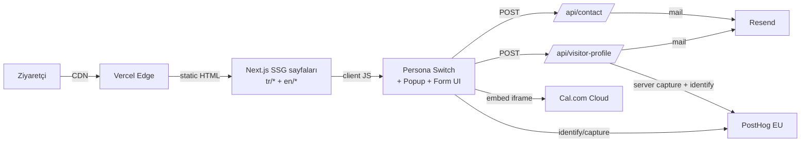
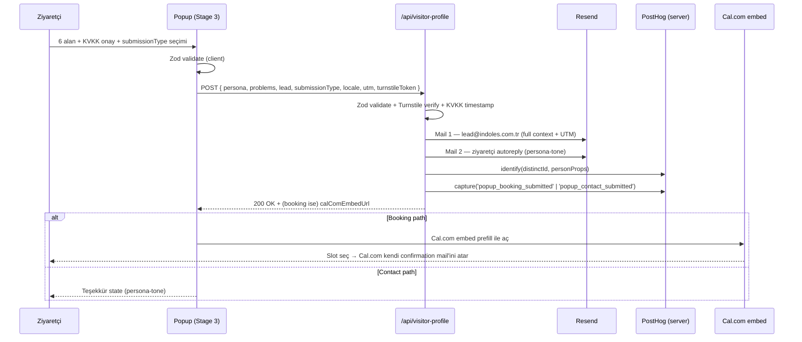
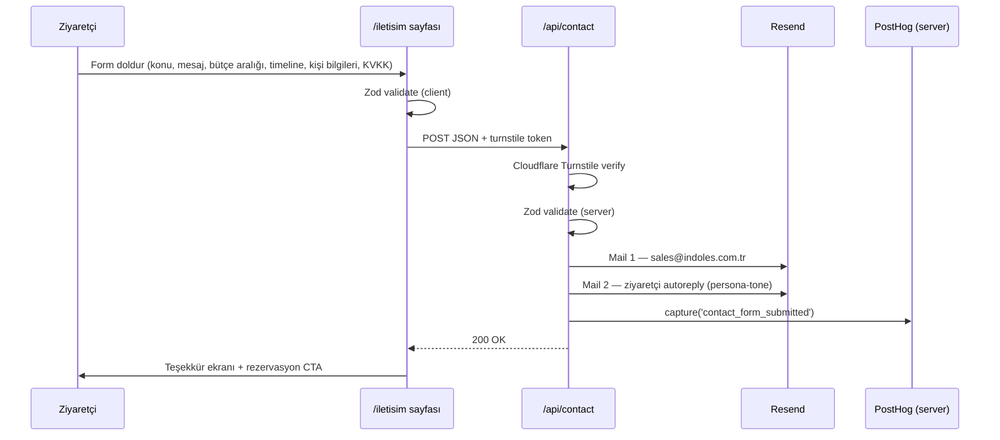
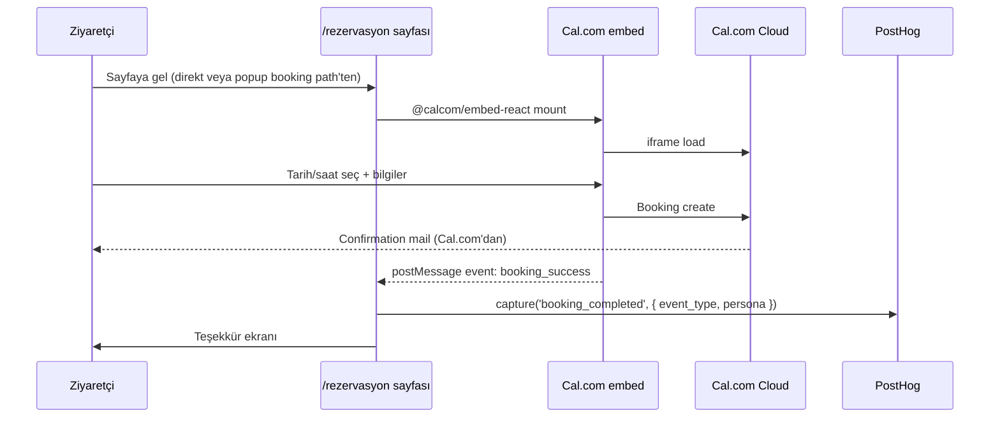

# INDOLES Web — Mimari Sadeleştirme Spec

> **Tarih:** 2026-04-17
> **Durum:** Taslak — review bekliyor
> **Karar sahibi:** Burak Arda Özgül
> **Bağlı belgeler:** `CLAUDE.md`, `docs/05-tech-architecture.md`, `docs/superpowers/specs/2026-04-17-entry-popup-design.md`, `docs/decisions/ADR-006-remove-sanity.md`
> **Supersedes (altkatman):** `docs/superpowers/specs/2026-04-17-entry-popup-design.md` §6.3, §9, §10, §11.3, §14 altyapı detayları (davranışsal spec korunur)

---

## 1. Amaç ve Bağlam

### 1.1 Problem

Mevcut mimari (CLAUDE.md §4) 12 katmanlı tam-yığın bir ürün için tasarlandı: tRPC, Drizzle+Neon, Clerk auth (4 rol), Stripe+iyzico, Vercel AI SDK + Gemini agent, Inngest background jobs, Sanity (ADR-006 ile reddedildi ama izleri package.json'da), SST Ion + AWS deploy, Axiom log. Ancak site, launch fazında:

- Self-signup kullanıcı yok (danışan vitrini iç ekip, Faz 2'ye kadar auth gereksiz)
- Ödeme akışı yok (paketler quote + görüşme üzerinden satılıyor)
- Background job ihtiyacı yok (mail sync, tek endpoint yeter)
- AI agent'in somut değer ürettiği kritik yolculuk yok (rezervasyon Cal.com, brief contact form)

Sonuç: operasyonel yük launch ihtiyacının kat kat üstünde. 77+ dependency, 4 webhook route, migration disiplini, 4 rol permission matrix, iki ödeme gateway testi — hiçbiri bugünkü funnel'a değer katmıyor.

### 1.2 Çözüm

Siteyi **statik-öncelikli + minimal serverless** mimariye indirmek. Next.js 15 kalır, `output: 'export'` değil — Vercel SSG+ISR default davranışı. İki serverless API route (`/api/contact`, `/api/visitor-profile`). Veri saklama yok: Resend mail arşivi + PostHog person properties yeterli.

**Korunan değer:** Persona-driven dual-view homepage, entry popup (3-stage davranışı aynen), Cal.com rezervasyon, i18n (TR+EN parite), editorial-minimalist design system, tüm `docs/*.md` içeriği.

**Çıkarılan:** Auth (Clerk), DB (Neon+Drizzle), payments (Stripe+iyzico), AI agent (Vercel AI SDK+Gemini), background jobs (Inngest), Sanity izleri, SST/AWS, Axiom.

### 1.3 Hedefler

- `package.json` dependencies: ~77 → ~30 (kaldırılan 14+ paket ailesi)
- Operasyonel karmaşıklık: 0 DB migration, 0 webhook, 0 background job, 0 auth session
- Deploy: SST/AWS → Vercel (preview per-PR otomatik)
- Popup spec (`entry-popup-design.md`) davranışsal olarak %100 korunur
- Launch'ta 2 hafta içinde taşınma hedefi

### 1.4 Out of Scope

| Kapsam dışı | Sebep |
|---|---|
| Astro veya başka framework'e migration | Yaklaşım 2 reddedildi; yatırım kayıp, performans kazancı marjinal |
| `output: 'export'` (pure static) | Yaklaşım 3 reddedildi; Resend API key client-side açılamaz |
| Custom admin panel | Mail + PostHog yeter; ihtiyaç somutlaşırsa Faz 2 ADR |
| Duplicate submission kontrolü | Launch'ta kaldırıldı (§5.1.4 altında, mevcut popup-design §15.2 override) |
| Popup ↔ Cal.com booking ID eşleşmesi | Faz 2'de webhook köprüsüyle gelecek |
| DB tabanlı raporlama / CRM lock-in (HubSpot vb.) | PostHog insight'ları yeter; CRM entegrasyonu sonra |

---

## 2. Mimari Genel Görünüm

### 2.1 Akış



### 2.2 Katmanlar

| Katman | İçerik |
|--------|--------|
| **Statik** | Tüm sayfalar build time'da HTML. Persona switch, popup, form = client-side React. |
| **Serverless (2 route)** | `/api/contact` (iletişim formu → Resend mail + PostHog). `/api/visitor-profile` (popup Stage 3 submit → Resend + PostHog). |
| **External (3 servis)** | Cal.com (rezervasyon embed), PostHog EU (analytics + person properties + feature flags + replay), Resend (transactional mail). |

### 2.3 Veri saklama

Kalıcı DB yok. Ziyaretçi verisi iki yerde yaşar:

- **PostHog person properties:** `persona`, `industry`, `role`, `company_name`, `first_seen_locale`, `utm_*`, `popup_completed_at`, `selected_problems`
- **Resend mail arşivi:** Her popup submit ve her contact submit bir mail olarak INDOLES inbox'ında kalır

### 2.4 Runtime ayak izi

- 2 serverless function (her biri <100 satır, Node runtime)
- 0 cron / 0 webhook / 0 background job
- 0 auth session / 0 middleware (next-intl path handling dışında)
- 1 statik build artifact (Vercel)

---

## 3. Dependency Envanteri

### 3.1 Kalan dependencies (30 civarı)

| Kategori | Paket | Rol |
|----------|-------|-----|
| Framework | `next`, `react`, `react-dom` | Next.js 15 SSG + 2 API route |
| Styling | `tailwindcss@4`, `@tailwindcss/postcss`, `postcss`, `prettier-plugin-tailwindcss` | Design tokens |
| UI primitives | `@radix-ui/react-dialog`, `react-popover`, `react-dropdown-menu`, `react-label`, `react-slot`, `react-tooltip` | Popup, menü, tooltip |
| UI utils | `class-variance-authority`, `clsx`, `tailwind-merge`, `lucide-react` | Component API |
| Motion | `framer-motion` | Hero + transitions |
| Form | `react-hook-form`, `@hookform/resolvers`, `zod` | Contact + popup Stage 3 form |
| i18n | `next-intl` | `/tr/*` + `/en/*` path-based routing |
| Calendar | `@calcom/embed-react` | Cal.com embed + prefill |
| Mail | `resend`, `@react-email/components`, `@react-email/render` | Transactional mail templates |
| Analytics | `posthog-js`, `posthog-node` | Client + server capture |
| Observability | `@sentry/nextjs` | Error tracking |
| Test | `vitest`, `@testing-library/react`, `@testing-library/jest-dom`, `jsdom`, `@playwright/test` | Unit + E2E |
| Dev | `typescript`, `eslint`, `prettier`, `eslint-config-next` | — |
| MDX (blog) | `@next/mdx` veya `next-mdx-remote` | Yazılar için |

### 3.2 Çıkan dependencies (14+ paket ailesi)

| Paket | Gerekçe |
|-------|---------|
| `@clerk/nextjs`, `svix` | Auth + webhook yok |
| `@trpc/client`, `@trpc/server`, `@trpc/next`, `@trpc/react-query`, `@tanstack/react-query`, `superjson` | RPC yok; sadece 2 REST route |
| `drizzle-orm`, `drizzle-zod`, `drizzle-kit`, `@neondatabase/serverless`, `pg`, `@types/pg` | DB yok |
| `stripe`, `iyzipay` | Ödeme yok |
| `@ai-sdk/google`, `ai` | AI agent yok |
| `inngest` | Background job yok |
| `@sanity/image-url`, `@sanity/vision`, `@sanity/webhook`, `next-sanity`, `sanity` | ADR-006, dev dep temizliği |
| `sst`, `@vitejs/plugin-react` | Deploy Vercel'e geçti |
| `@axiomhq/js` | Log Vercel + Sentry'e toplanır |
| `react-email` (CLI) | `@react-email/components` yeter |

### 3.3 package.json scripts temizliği

Kaldırılan: `db:generate`, `db:migrate`, `db:push`, `db:studio`, `db:seed`, `sanity:typegen`, `sst:dev`, `sst:deploy`.

Kalan: `dev`, `build`, `start`, `lint`, `typecheck`, `test`, `test:watch`, `test:e2e`, `test:e2e:ui`, `format`, `format:check`.

---

## 4. Route / Sayfa Haritası

### 4.1 Public sayfalar (SSG, TR + EN paralel)

```
app/
├── [locale]/
│   ├── layout.tsx                     # persona state, popup provider, PostHog init
│   ├── page.tsx                       # Anasayfa (persona-driven hero)
│   ├── hizmetler/                     # EN: services/
│   │   ├── page.tsx                   # 12 hizmet listesi
│   │   └── [slug]/page.tsx            # Tek hizmet sayfası
│   ├── paketler/                      # EN: packages/
│   │   ├── page.tsx
│   │   └── [slug]/page.tsx
│   ├── vaka-calismalari/              # EN: case-studies/
│   │   ├── page.tsx                   # Problem-tipi filtresiyle liste
│   │   └── [slug]/page.tsx
│   ├── danisanlar/                    # EN: consultants/
│   │   ├── page.tsx                   # İç ekip
│   │   └── [slug]/page.tsx
│   ├── yazilar/                       # EN: journal/
│   │   ├── page.tsx                   # MDX blog listesi
│   │   └── [slug]/page.tsx            # MDX render
│   ├── hakkimizda/page.tsx            # EN: about/
│   ├── iletisim/page.tsx              # EN: contact/
│   ├── rezervasyon/page.tsx           # EN: book/ (Cal.com embed)
│   └── gizlilik-kvkk/page.tsx         # EN: privacy-kvkk/
├── api/
│   ├── contact/route.ts               # POST — iletişim/brief form
│   └── visitor-profile/route.ts       # POST — popup Stage 3
├── sitemap.ts                         # Per-locale sitemap
├── robots.ts
├── llms.txt
└── llms-full.txt
```

### 4.2 URL segment translation

`docs/08-seo-i18n-strategy.md` ve `docs/02-information-architecture.md` authoritative. Tam liste oralarda; bu spec segment yapısını değiştirmez.

### 4.3 Kaldırılan route'lar

| Route | Gerekçe |
|-------|---------|
| `/api/agent/*` | AI agent kaldırıldı (ADR-007) |
| `/api/trpc/*` | tRPC kaldırıldı |
| `/api/webhooks/clerk` | Auth yok (ADR-008) |
| `/api/webhooks/stripe`, `/api/webhooks/iyzico` | Ödeme yok (ADR-009) |
| `/api/inngest` | Background job yok (ADR-011) |
| `/sign-in`, `/sign-up`, `/dashboard`, `/admin/*` | Auth yok |
| `/studio/*` (Sanity) | ADR-006 |

---

## 5. Veri Akışları

### 5.1 Popup (3-stage davranışı korunur)

**Davranışsal kaynak:** `docs/superpowers/specs/2026-04-17-entry-popup-design.md` bölüm 2-7, 12-15. Alttaki alt-katman ilgili bölümlerin yerini alır.

#### 5.1.1 Stage 1 / Stage 2 (client-only)

Spec §4 ve §5 aynen uygulanır. DB veya API çağrısı yok — seçimler client state'te tutulur, PostHog event'leri atılır (`popup_stage1_selected`, `popup_stage2_submitted`). Problem taxonomy `src/lib/content/problems.ts` içinde, TR+EN cümleler `messages/{locale}/popup-problems.json`'da.

#### 5.1.2 Stage 3 (API çağrısı)



#### 5.1.3 Payload şeması

```ts
// src/lib/schemas/visitor-profile.ts
export const visitorProfileSchema = z.object({
  persona: z.enum(['donusum-teknoloji', 'buyume-pazarlar']),
  problems: z.array(z.string()).length(3),         // problem slug'ları
  lead: z.object({
    firstName: z.string().min(2),
    lastName: z.string().min(2),
    phone: z.string().regex(/^\+?[0-9\s-]{7,}$/),
    email: z.string().email(),
    company: z.string().min(2),
    title: z.string().min(2),
  }),
  submissionType: z.enum(['booking', 'contact']),
  kvkkConsent: z.literal(true),
  locale: z.enum(['tr', 'en']),
  utm: z.object({
    source: z.string().optional(),
    medium: z.string().optional(),
    campaign: z.string().optional(),
  }).optional(),
  turnstileToken: z.string(),
});
```

#### 5.1.4 Spec'ten düşen / adapte olan

| Spec'te | Bu spec'te |
|---|---|
| `tRPC popup.submit` | `POST /api/visitor-profile` (REST) |
| `INSERT popup_submissions` (Neon) | DB yok — mail + PostHog person props |
| Server-side Cal.com API booking create | Client-side embed prefill; server-side çağrı yok |
| Inngest `popup/lead.created` queue | Route içinde sync Resend çağrısı (3 retry) |
| Chatbot context injection (§8) | **Düşer** — AI agent kaldırıldı |
| 24 ay retention cron (Inngest monthly) | **Düşer** — DB yok; mail retention INDOLES inbox policy'sinde. PostHog person retention PostHog ayarında. |
| `popup_submissions` tablosu (§9.2) | **Düşer** |
| Duplicate submission kontrolü (§15.2) | **Düşer** — launch'ta tamamen kaldırıldı |
| `cal_com_booking_id` popup submission ile eşleşme | **Düşer** — Faz 2'de webhook köprüsü |

#### 5.1.5 Spec'ten korunan (aynen)

- Stage 1/2/3 akışı, layout, copy kuralları (§4-6)
- Tetikleme + cookie `indoles_popup_state` (§3)
- 20 problem taksonomisi (§5.3-5.4)
- Homepage hero default nötr + chip pattern (§7)
- KVKK aydınlatma + cookie policy (§12.1-12.2)
- i18n (§13)
- PostHog event taksonomisi (§14.1, §14.2)
- Feature flag `popup_enabled` (§14.3)
- Edge cases (network, double-submit, mobile, a11y, perf) (§15) — "duplicate check" maddesi hariç

### 5.2 Contact / Brief Form



**Spam koruma:** Cloudflare Turnstile (ücretsiz, captcha'sız). reCAPTCHA değil.

**Mail template'leri:** `emails/contact-notification.tsx` (iç), `emails/contact-autoreply.tsx` (ziyaretçi, persona-tone). Persona belirlenmemişse nötr ton.

### 5.3 Rezervasyon (Cal.com)



Ek `/api/booking` route yok. Cal.com kendi mail'ini ve takvim davetini atar.

---

## 6. İçerik Modeli

### 6.1 Kaynak yapısı

```
src/lib/content/
├── services.ts          # 12 hizmet (3 pillar: Growth 5 / Transform 5 / Build 2)
├── packages.ts          # Ürünleşmiş paketler
├── case-studies.ts      # Vaka çalışmaları (problem-tipi bazlı)
├── consultants.ts       # İç ekip (Faz 1)
├── problems.ts          # 20 popup problem taksonomisi (10+10)
└── pillars.ts           # Pillar tanımları

content/yazilar/
├── tr/{slug}.mdx        # TR blog
└── en/{slug}.mdx        # EN blog
```

### 6.2 Type disiplini

Her dosya TypeScript type export eder. Örnek shape:

```ts
export type Service = {
  slug: { tr: string; en: string };   // URL segment translation
  pillar: 'growth' | 'transform' | 'build';
  title: { tr: string; en: string };
  tagline: { tr: string; en: string };
  description: { tr: string; en: string };
  outcomes: { tr: string[]; en: string[] };
  personaFit: Array<'sanayici' | 'ticaret'>;
  relatedPackages: string[];
  relatedCaseStudies: string[];
};
```

### 6.3 i18n parite kuralı

- Her field `{ tr; en }` shape'inde. Eksik field yasak (build-time check).
- `content/yazilar/` içinde TR'si olmayan EN yazı yayınlanamaz.
- `indoles-i18n-seo` skill enforce eder.

### 6.4 MDX

- Yalnızca blog (`/yazilar`, `/journal`) MDX.
- Hizmet/paket/vaka = TS data + React component (layout sabit, MDX serbestliği istenmez).

### 6.5 Content → Route eşleşmesi

| İçerik | Route (SSG) | Build mantığı |
|--------|-------------|---------------|
| `services.ts` | `/{locale}/{hizmetler\|services}/[slug]` | `generateStaticParams` hizmet × 2 locale |
| `packages.ts` | `/{locale}/{paketler\|packages}/[slug]` | Aynı |
| `case-studies.ts` | `/{locale}/{vaka-calismalari\|case-studies}/[slug]` | Aynı |
| `consultants.ts` | `/{locale}/{danisanlar\|consultants}/[slug]` | Aynı |
| `problems.ts` | (route yok) | Popup Stage 2 tüketir |
| `yazilar/*.mdx` | `/{locale}/{yazilar\|journal}/[slug]` | MDX front-matter + dosya isminden slug |

### 6.6 Görsel / medya

- Hero görseli: `public/content/{type}/{slug}/cover.{webp,jpg}`
- MDX inline resim: yazı klasöründe relative import
- Stok foto yasak (CLAUDE.md §3)

---

## 7. Error Handling & Observability

### 7.1 Client-side

| Durum | Davranış |
|-------|----------|
| Form validation (Zod) | Inline hata, field altında. Toast yok. |
| `/api/*` 4xx | Form state korunur, alan-bazlı hata gösterilir. |
| `/api/*` 5xx / network fail | Generic mesaj: "Bir sorun oluştu, tekrar dene." Sentry browser SDK capture. |
| Cal.com embed load fail | Fallback: "Rezervasyon yüklenemedi. [İletişim] veya +90-..." |
| PostHog init fail | Sessiz degrade. |

### 7.2 Server-side (2 route)

| Durum | Davranış |
|-------|----------|
| Zod validation fail | 400 + alan-bazlı hata |
| Turnstile verify fail | 403 + "Doğrulama başarısız" |
| Resend fail | Route içinde 3 retry (exponential backoff 500ms / 1.5s / 4.5s). Hepsi fail → 500 + Sentry capture. |
| PostHog capture fail | Mail başarılıysa 200 döndür; PostHog hatası Sentry'e log'lanır. |
| Unexpected exception | 500 + Sentry capture (server SDK). |

### 7.3 Observability katmanı

| Araç | Kapsam |
|------|--------|
| **Sentry** (`@sentry/nextjs`) | Client + server error tracking. Release tagging CI'da. PII scrubbing (email/phone maske). |
| **PostHog EU** | Funnel (entry-popup-design.md §14.2), feature flag (`popup_enabled`), session replay (IP masking + form field masking). |
| **Vercel built-in** | Function log, Web Vitals, Speed Insights. |
| **Resend dashboard** | Mail delivery status, bounce/complaint rate. |

### 7.4 Loglama disiplini

- `console.log` prod'da yok — tüm log Sentry breadcrumb veya PostHog event.
- Structured: `logger.info({ event: 'popup_submit', persona, problems })`.
- PII maskeleme zorunlu.

### 7.5 Uptime izleme

Launch: Vercel built-in + Sentry cron monitoring (2 endpoint günlük health-ping). Ayrı uptime aracı yok. Faz 2'de değerlendirilir.

---

## 8. Testing

### 8.1 Unit (Vitest)

| Kapsam | Konum |
|--------|-------|
| Zod schema'lar | `src/lib/schemas/*.test.ts` |
| Content helper fonksiyonları | `src/lib/content/*.test.ts` |
| Problem taxonomy invariant'ları | `src/lib/content/problems.test.ts` |
| i18n parite guard | `src/i18n/parity.test.ts` |
| Design token leak check | `scripts/check-token-leaks.test.ts` |

### 8.2 Integration (Vitest + Next test utils)

- `/api/contact` route handler (request mock → Resend mock → response assert)
- `/api/visitor-profile` route handler (aynı + PostHog server SDK mock)
- Turnstile verify mock
- Mail template snapshot test (`@react-email/render` çıktısı)

### 8.3 E2E (Playwright) — 4 kritik yolculuk

```
tests/e2e/
├── popup-full-flow.spec.ts       # Stage 1 → 2 → 3 → booking path
├── popup-contact-path.spec.ts    # Stage 1 → 2 → 3 → contact path
├── persona-switch.spec.ts        # Homepage persona chip
└── contact-form.spec.ts          # /iletisim standalone
```

Her spec: `indoles-responsive-quality` skill uyarınca 4 viewport (375, 768, 1280, 1536). Screenshot diffing.

### 8.4 Kaldırılan E2E'ler

`auth-*.spec.ts`, `booking-auth.spec.ts`, `payment.spec.ts`, `agent-chat.spec.ts`, `admin-*.spec.ts` — kod kalktığı için.

### 8.5 Dışı bırakılanlar

| Kapsam | Gerekçe |
|--------|---------|
| Visual regression (Chromatic/Percy) | Launch'ta aşırı; Playwright screenshot yeter |
| Load testing (k6/Artillery) | 2 route + CDN; Vercel throttling zaten yük testi |
| Contract test | Dış API'lar resmî SDK'lı |
| Accessibility otomasyonu (axe/LH CI) | `indoles-responsive-quality` + `ux-audit-2026` kapsar |

### 8.6 CI

GitHub Actions tek workflow:

```
1. pnpm install
2. pnpm lint
3. pnpm typecheck
4. pnpm test (Vitest)
5. pnpm build
6. pnpm test:e2e (preview deploy sonrası)
```

Per-PR Vercel preview deploy otomatik. Test fail → merge block.

---

## 9. Deploy & Ops

### 9.1 Hosting

**Vercel** (eu-central tercih). SST/AWS kaldırıldı (ADR-012).

- Preview per-PR otomatik
- Env yönetimi Vercel Dashboard'da
- Analytics: Vercel Web Analytics + Speed Insights (Core Web Vitals + edge metrics); PostHog (funnel + replay + feature flag) farklı katmanda — çakışma yok

### 9.2 Env değişkenleri

| Key | Kaynak |
|-----|--------|
| `RESEND_API_KEY` | Resend dashboard |
| `POSTHOG_API_KEY` (client) | PostHog |
| `POSTHOG_PERSONAL_API_KEY` (server) | PostHog |
| `POSTHOG_HOST` | `https://eu.posthog.com` |
| `SENTRY_DSN`, `SENTRY_AUTH_TOKEN` | Sentry |
| `TURNSTILE_SITE_KEY`, `TURNSTILE_SECRET_KEY` | Cloudflare |
| `CAL_COM_EMBED_URL` | Cal.com dashboard |
| `LEAD_INBOX_EMAIL` | `lead@indoles.com.tr` |
| `SALES_INBOX_EMAIL` | `sales@indoles.com.tr` |

### 9.3 Kaldırılan env'ler

`DATABASE_URL`, `NEON_*`, `CLERK_*`, `STRIPE_*`, `IYZICO_*`, `GOOGLE_GENERATIVE_AI_API_KEY`, `INNGEST_*`, `SANITY_*`, `SST_*`, `AXIOM_*`.

---

## 10. Güncellenecek Docs ve ADR'lar

### 10.1 Yeni ADR'lar

Mevcut numaralama `ADR-001` → `ADR-006` arası dolu. `ADR-004` ve `ADR-005` popup-design.md §16'da planlanmış ama henüz yazılmamıştı; simplification kapsamında artık gereksiz (quick-book auth yok, booking süresi Cal.com event type'ında tanımlanır) — **yazılmayacak olarak işaretlenir**, cross-ref `ADR-013`'te verilir.

| ADR | Konu |
|-----|------|
| ADR-007 | AI agent kaldırılması (`docs/07-ai-agent-spec.md` arşive alınır) |
| ADR-008 | Clerk / auth kaldırılması (`docs/09-auth-roles-permissions.md` KVKK bölümü hariç arşive) |
| ADR-009 | Payment (Stripe/iyzico) kaldırılması |
| ADR-010 | DB (Neon + Drizzle) kaldırılması — popup data → Resend + PostHog |
| ADR-011 | Background jobs (Inngest) kaldırılması |
| ADR-012 | Deploy SST/AWS → Vercel |
| ADR-013 | Popup altkatman: tRPC → REST, DB → mail+PostHog (davranış korunur); planlanan ADR-004/005 bu sadeleştirmede gereksiz |

### 10.2 Güncellenecek docs

| Dosya | Güncelleme |
|-------|------------|
| `CLAUDE.md` §4 Tech Stack | Sadeleşmiş stack tablosu |
| `CLAUDE.md` §6 Out of Scope | Auth (Faz 2), ödeme (Faz 2), AI agent (Faz 2) eklenir |
| `docs/05-tech-architecture.md` | Mimari diyagramlar sade versiyonla |
| `docs/06-data-model.md` | Tüm tablolar kaldırılır; "Launch'ta DB yok" notu + Faz 2 roadmap |
| `docs/07-ai-agent-spec.md` | Başına "Arşive alındı — ADR-007" not; dosya silinmez, referans |
| `docs/09-auth-roles-permissions.md` | KVKK bölümü hariç arşive; KVKK kısmı yeni dosyaya |
| `docs/11-funnel-customer-flows.md` | Auth-required booking path kaldırılır; tek path quick-book |
| `docs/superpowers/specs/2026-04-17-entry-popup-design.md` | Alt katman revize — ADR-013 ile cross-ref, değişenler işaretlenir |

### 10.3 Silinecek dosyalar (kod)

`src/server/db/*`, `src/server/trpc/*`, `src/server/auth/*`, `src/server/payments/*`, `src/server/agent/*`, `src/server/inngest/*`, `drizzle.config.ts`, `sanity.config.ts`, `sst.config.ts`.

---

## 11. Geçiş Planı (yüksek seviye)

Detaylı plan `writing-plans` skill'i ile sonraki adımda `docs/superpowers/plans/2026-04-17-simplification-plan.md` altına yazılacak. Yüksek seviye sıra:

1. ADR-007 → ADR-013 taslaklarını yaz ve onaya sun
2. `package.json` cleanup + env temizliği
3. Silinecek route'lar ve `src/server/*` alt-ağaçları
4. `/api/contact` ve `/api/visitor-profile` route handler'ları
5. Popup component'ini tRPC yerine REST fetch'e bağla
6. Cal.com embed prefill akışı
7. Resend mail template'leri (React Email)
8. Turnstile entegrasyonu
9. Docs + CLAUDE.md güncellemeleri
10. E2E test suite refactor
11. Vercel deploy setup + env migration
12. Prod cutover

Hedef: 2 hafta (10 iş günü).

---

## 12. Risk ve Açık Konular

| Risk | Azaltma |
|------|---------|
| **Mail arşivi = veri kaynağı.** Inbox kaybı = lead geçmişi kaybı. | Resend webhook → ikincil log'a (S3 veya basit key-value) Faz 2'de eklenebilir. Launch'ta mail + PostHog person props yeterli redundancy. |
| **PostHog quota**: free tier event limiti aşılırsa kayıp. | Event volume launch'ta düşük; 1M event/month ücretsiz. Aşımdan önce billing uyarı. |
| **Cal.com down süreci** popup booking path'i bozar. | Popup'ta booking path fail durumunda contact path'e fallback önerisi + hata state'i. |
| **Turnstile JS load fail** form submission'ı engeller. | Graceful degradation: Turnstile fail olursa rate-limit (IP per 5 min) fallback — küçük inline logic. |
| **Docs ↔ spec tutarsızlığı** kaldırılan dosyalarda. | ADR cross-ref + `docs/*.md` header'larına "Supersedes" notu. |

---

## 13. Sonraki Adım

Spec onaylandıktan sonra `superpowers:writing-plans` skill'i ile implementasyon planı `docs/superpowers/plans/2026-04-17-simplification-plan.md` altına yazılacak. Plan her maddeyi iş emrine çevirir (hangi dosya, hangi test, hangi migration adımı).
